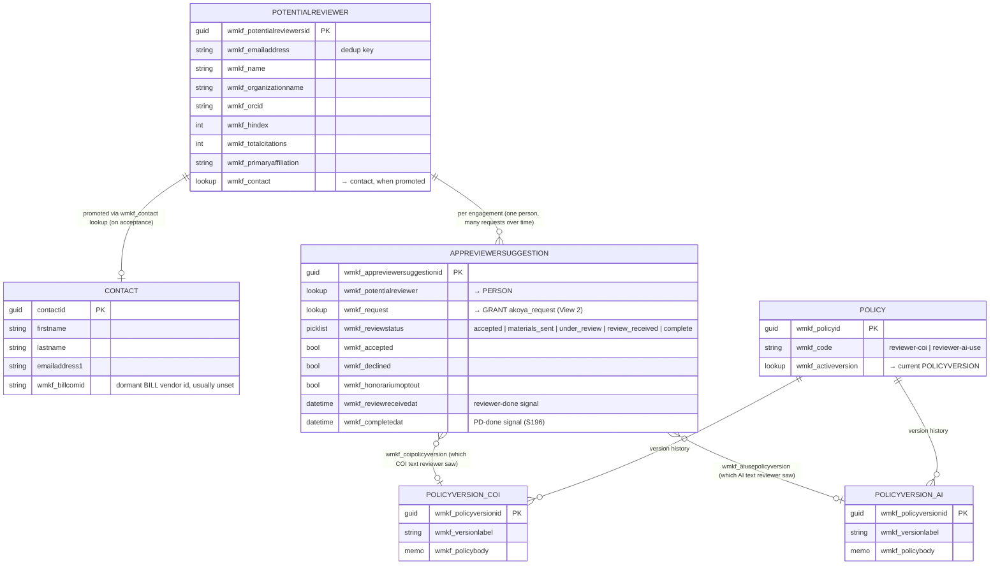
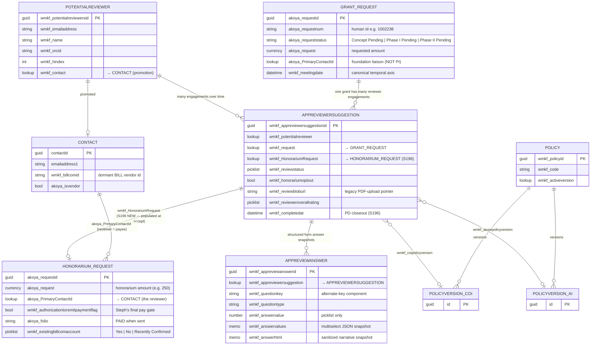

# Reviewer Data Model

Visual orientation for the reviewer-domain Dataverse entities and how they connect. Use this when you're not sure which entity holds which piece of data, or when a piece of reviewer data is created.

> **Authoritative source for any single entity is its atlas page** (`docs/atlas/dataverse-*.md`). This doc summarizes the connections; the atlas pages have the per-field detail.

> **Production boundary (2026-07-31):** deployment
> `dpl_35pUuvT8DowJPHbyBsiJxKGRNMZT` at `824bfcc6` serves the source model
> below: invitation send never creates/links a Contact or back-propagates ORCID;
> identity-bearing acceptance does.

> **Current review-content authority (owner-confirmed 2026-07-26):** the live
> reviewer workflow is the in-browser form. Final submit writes structured
> `wmkf_appreviewanswer` child rows to Dataverse and marks the engagement
> received. Review PDFs, `wmkf_reviewbloburl`, `wmkf_reviewfilename`, and
> `wmkf_reviewsharepointfolder` belong to the earlier file-upload experiment and
> retained rescue/compatibility paths. Their presence does not prove a current or
> genuine review; legacy test files are known to remain.

> **Identity-binding durability foundation (deployed, not authoritative,
> 2026-07-13):** Wave 13 added nullable binding generation/source/anchor/time,
> derived-generation, and per-field-lineage columns to the person, plus COI
> status/binding-generation/context-hash/check-time columns to the engagement.
> **[VERIFIED 2026-07-13 via `node
> scripts/preflight-reviewer-identity-binding-fields.mjs --target=prod
> --include-population`]** typed production metadata reported all ten EXACT and
> zero rows with any Wave 13 field populated. This is a dated snapshot captured
> in `docs/audits/reviewer-identity-binding-prod-preflight-2026-07-13.md`, not a
> permanent current-state guarantee. An ETag-protected person-binding writer
> selects/PATCHes the six person fields. Its first production caller is live
> since PR #57 / `00ffb09c`: a reviewer
> acceptance job with a stable `accepted_at` durably binds self-reported ORCID
> before honorarium/contact follow-up. The four engagement COI fields still have
> no application reader/writer. Null remains legacy/unknown; later
> eligibility will be computed rather than stored. See the two entity Atlas
> pages and `docs/REVIEWER_HOLISTIC_REVIEW_IMPLEMENTATION_PLAN.md` I1/I2.

---

## Entities at a glance

| Entity | What it is | When the row appears | Row count |
|---|---|---|---|
| `wmkf_potentialreviewer` | The **person**. Custom Foundation entity (not vendor). Global. One row per real human, dedup'd on email. Row origin tracked in `wmkf_source` — currently two main paths: (a) **Reviewer Finder** discovery (rich enrichment, full bibliometrics), (b) **Applicant-submitted** during application intake (sparse: usually just name + affiliation + email). The same person can later be enriched if Reviewer Finder picks them up, or via the Workbench "enrich recommended reviewers" action (S211). | First touch by either path. | 4,427 |
| ~~`wmkf_appresearcher`~~ | **DROPPED S213** — the bibliometric sidecar (h-index, ORCID, citations, scholar URL) was collapsed onto `wmkf_potentialreviewer`. Those fields now live on the person; written by Reviewer Finder enrichment + the Workbench "enrich recommended reviewers" action. See "What changed" below. | — |
| `contact` | The **CRM contact**. Where canonical identity ultimately lives. | Promoted from `wmkf_potentialreviewer` on identity-bearing acceptance, including honorarium opt-out; invitation send and decline do not promote. | (vendor table — many) |
| `wmkf_appreviewersuggestion` | The **per-(reviewer, request) engagement**. Lifecycle ledger for state, timestamps, decline reason, policy acknowledgments, and links. Current structured review content lives in its `wmkf_appreviewanswer` children. | Reviewer Finder save-candidates creates one per (person, request). | 724 |
| `wmkf_appreviewanswer` | One immutable structured answer snapshot per submitted question, linked to the engagement. This is the current review-content authority for ratings, multiselect selections, and narratives. | Final form submit; alternate key is suggestion + question key. | (child rows) |
| `akoya_request` (grant) | The **proposal being reviewed**. | Created when WMKF intakes a grant request. | 25,473+ |
| `akoya_request` (honorarium) | The **honorarium request for the reviewer**. Same entity class as the grant, distinct row-purpose. | Created at reviewer accept time by the portal when honorarium creation is enabled; BILL onboarding remains deferred. | (subset of the same 25,473) |
| `wmkf_policy` / `wmkf_policyversion` | Versioned policy text (COI, AI use). | Staff edits in admin UI. | 2 / 8 |

---

## View 1 — Reviewer-domain only

### The minimum picture: who the reviewer is, the engagement, and policy acknowledgments. No grant, no honorarium.

---

## View 2 — Expanded: + grant request + honorarium request

Adds the two `akoya_request` flavors (the grant being reviewed and the honorarium paying the reviewer) so you can see how the engagement spans both.

**Note on the two `akoya_request` flavors.** Both `GRANT_REQUEST` and `HONORARIUM_REQUEST` are the SAME Dataverse entity (`akoya_request`). They're distinguishable only by their field values — primarily `akoya_program`, `wmkf_grantprogram`, and `wmkf_type`. The new `wmkf_HonorariumRequest` lookup on `wmkf_appreviewersuggestion` exists precisely so we don't have to infer the grant↔honorarium relationship by data-mining; it's recorded explicitly at create time.

---

## Lifecycle write-paths

When does each entity get touched? Stages mirror `docs/REVIEWER_INTERACTION_DESIGN.md`.

```mermaid
flowchart TD
    S0["Stage 0 — Reviewer Finder discovers candidate"] --> S0w["WRITES:<br/>• wmkf_potentialreviewer (upsert by email; bibliometrics on the person since S213)<br/>• wmkf_appreviewersuggestion (engagement, selected=true)"]

    S0w --> S1["Stage 1 — PD invites (send-emails)"]
    S1 --> S1w["WRITES:<br/>• wmkf_appreviewersuggestion: invited=true, wmkf_emailsentat, external token fields<br/>• no Contact create/link/update"]

    S1w --> S2A{"Stage 2a — Reviewer responds"}
    S2A -->|Accept| S2acc["WRITES on wmkf_appreviewersuggestion:<br/>• accepted=true, wmkf_responsereceivedat, wmkf_responsetype<br/>• engagement-scope contact corrections (wmkf_reviewerfirstname, lastname, email, ORCID, title)<br/>• wmkf_coiackedat + wmkf_coipolicyversion<br/>• wmkf_aiuseackedat + wmkf_aiusepolicyversion<br/>• wmkf_honorariumoptout"]
    S2acc --> S2contact["Accepted-contact follow-up (all accepts, including opt-outs):<br/>• validate active existing links and identity-aware Contact reuse<br/>• ORCID-scoped deterministic create + reviewer link in one ETag-guarded changeset<br/>• ambiguous/split/inactive/namesake evidence stays unlinked for staff review<br/>• mailing address + eligible ORCID captured after a safe link"]
    S2contact -->|Honorarium not opted out| S2hon["Current no-BILL honorarium chain:<br/>• akoya_request CREATED (honorarium row)<br/>• wmkf_appreviewersuggestion.wmkf_HonorariumRequest set<br/>• honorarium links to reviewed proposal<br/>• BILL onboarding returns deferred (no vendor/network call)"]

    S2A -->|Decline| S2dec["WRITES on wmkf_appreviewersuggestion:<br/>• declined=true, wmkf_responsetype<br/>• optional wmkf_declinereasonpicklist<br/>• wmkf_declinereferral (versioned structured rows;<br/>legacy free text remains readable)"]

    S2A -->|No response| S2nor["No write at decision time; staff cancels later as<br/>wmkf_withdrawnsufficientat (Withdrawn-Sufficient state)"]

    S2hon --> S3["Stage 3 — Materials sent"]
    S2contact -->|Honorarium opted out| S3
    S3 --> S3w["WRITES on wmkf_appreviewersuggestion:<br/>• wmkf_materialssentat<br/>• wmkf_proposalurl, wmkf_proposalpassword<br/>• wmkf_reviewstatus = materials_sent"]

    S3w --> S4["Stage 4 — Reviewer works in form<br/>(Postgres review_drafts scratchpad)"]
    S4 --> S5["Stage 5 — Reviewer submits review"]
    S5 --> S5w["ONE Dataverse changeset:<br/>• UPSERT wmkf_appreviewanswer rows (ratings, multiselect, narratives)<br/>• PATCH suggestion affiliation + wmkf_reviewreceivedat (PAYMENT-ELIGIBILITY SIGNAL)<br/>• wmkf_reviewstatus = review_received<br/>Then delete Postgres draft.<br/>Legacy PDF/file/rating parent fields are not the current content authority."]

    S5w --> S6["Stage 6 — PD closes out (Request Workbench, S196)"]
    S6 --> S6w["WRITES on wmkf_appreviewersuggestion:<br/>• wmkf_reviewstatus = complete<br/>• wmkf_completedat<br/><br/>Row drops off PD dashboard."]

    S6w --> S7["Stage 7 — finance processes payment offline"]
    S7 --> S7w["Honorarium request remains the CRM record;<br/>automated BILL vendor/network/webhook tail is dormant"]
```

---

## "Where do I look for X?" reference

| Question | Entity / field | Notes |
|---|---|---|
| Reviewer's canonical name + email | `contact` (post-promotion) or `wmkf_potentialreviewer` (pre-promotion) | Identity-bearing acceptance promotes via `wmkf_potentialreviewer.wmkf_contact`; invitation send and decline do not |
| Reviewer's engagement-scope corrections (they updated their email at accept) | `wmkf_appreviewersuggestion.wmkf_revieweremail` etc. | The engagement keeps its snapshot. Accepted-contact resolution may use submitted name/email to safely reuse or create a Contact and separately sync trusted name/title, but it never blindly overwrites an existing Contact email. |
| h-index / citation count / ORCID / scholar URL | `wmkf_potentialreviewer.wmkf_hindex` etc. | on the person (S213; was the `wmkf_appresearcher` sidecar) |
| Accept/decline state | `wmkf_appreviewersuggestion.wmkf_responsetype` (picklist) + `.wmkf_accepted` / `.wmkf_declined` booleans | |
| Decline reason and alternate-reviewer referrals | `wmkf_appreviewersuggestion.wmkf_declinereasonpicklist` (structured) + `.wmkf_declinereferral` | The current portal has no prose reason/referral fields. It stores up to four name/institution/email rows as a versioned envelope in the existing referral memo; legacy `.wmkf_declinereason` and free-text referral values remain readable for compatibility. |
| COI / AI policy acknowledged? | `wmkf_appreviewersuggestion.wmkf_coiackedat` (timestamp) + `wmkf_coipolicyversion` (which version they saw) | Same shape for AI-use |
| Honorarium opt-out | `wmkf_appreviewersuggestion.wmkf_honorariumoptout` | |
| The honorarium row for a reviewer engagement | `akoya_request` via `wmkf_appreviewersuggestion.wmkf_HonorariumRequest` | S196-new link; one hop |
| Honorarium amount | `akoya_request.akoya_request` (on the honorarium row) | Field name = entity name. Yes, confusing. |
| Is payment authorized? | `akoya_request.wmkf_authorizationtoremitpaymentflag` (honorarium row) | Steph's manual final gate |
| Has payment been sent? | `akoya_request.akoya_folio = 'PAID'` (honorarium row) | NOT `akoya_paymentsent` — empirically not a payment gate |
| BILL vendor id for a reviewer | `contact.wmkf_billcomid` | Retained dormant field; automated BILL onboarding is tabled |
| BILL network state | `akoya_request.wmkf_exisitngbillcomaccount` (honorarium row, sic spelling) | Retained dormant field; not the current payment path |
| Current submitted review content | `wmkf_appreviewanswer` rows linked by `_wmkf_appreviewersuggestion_value` | Structured form snapshots; use these for ratings, categorical selections, narratives, reports, and synthesis. |
| Legacy review PDF/file | `wmkf_appreviewersuggestion.wmkf_reviewbloburl` + `.wmkf_reviewfilename` + `.wmkf_reviewsharepointfolder` | Retained compatibility/rescue fields from the retired PDF-upload experiment. A pointer/file can be test baggage; verify provenance before treating it as review history or deleting it. |
| Current reviewer ratings | `wmkf_appreviewanswer` rows for `riskLevel` and `overallAssessment` | Parent `wmkf_revieweroverallrating` / `wmkf_reviewerimpact` / `wmkf_reviewerrisk` are legacy compatibility fields, not the structured answer authority. |
| External access token (magic link) | `wmkf_appreviewersuggestion.wmkf_externaltokenhash` + `.wmkf_externaltokenissued` / `expires` / `revoked` | Stored as HMAC hash, never plaintext |
| Has PD closed out the review? | `wmkf_appreviewersuggestion.wmkf_reviewstatus = complete` AND `.wmkf_completedat` set | S196-new |
| The grant being reviewed | `wmkf_appreviewersuggestion.wmkf_request → akoya_request` (the GRANT row) | |
| Where the reviewer was found | `wmkf_potentialreviewer.wmkf_source` (lead origin: Reviewer Finder vs applicant-submitted vs other) + `wmkf_appreviewersuggestion.wmkf_sources` (this-engagement provenance) | |

---

## What changed

**`wmkf_appresearcher` collapse — ✅ SHIPPED S213 (2026-06-02).** The bibliometric sidecar was structural redundancy. Seventeen fields were added to `wmkf_potentialreviewer`, all sidecar rows were backfilled, `adapters/researcher.js` was repointed to the person, callers were cut over, and `wmkf_appresearcher` plus the two empty publication tables were dropped. The diagrams above show the resulting two-table reviewer core directly; the as-executed history remains in `docs/archive/APPRESEARCHER_COLLAPSE_PLAN_V2.md`.

---

## Naming gotchas

- **`wmkf_potentialreviewers` (plural) is the entity logical name.** Most docs (including this one) write it as `wmkf_potentialreviewer` (singular) for readability. The OData API requires the plural form. This trips up new probe scripts — query `EntityDefinitions(LogicalName='wmkf_potentialreviewers')`, not `wmkf_potentialreviewer`.
- **`akoya_request.akoya_request` (entity-name-as-field-name)** is the currency field for "requested amount" — applies to both grant and honorarium rows.
- **`wmkf_exisitngbillcomaccount`** is misspelled in Dataverse (`exisitng` not `existing`). Do not "fix" it in queries.
- **`wmkf_appreviewersuggestion` (singular) is the entity logical name; entity-set is `wmkf_appreviewersuggestions` (plural).** OData URLs use the plural form.
- **Two `akoya_request` flavors live in one table.** Grant vs honorarium is a row-shape distinction, not a table distinction. Discriminator fields: `akoya_program`, `wmkf_grantprogram`, `wmkf_type`.

---

## See also

- `docs/atlas/dataverse-wmkf-appreviewersuggestion.md` — engagement junction (the central row)
- `docs/atlas/dataverse-wmkf-potentialreviewers.md` — person record
- (bibliometric fields now live on `docs/atlas/dataverse-wmkf-potentialreviewers.md` — the `wmkf_appresearcher` sidecar + its atlas page were dropped S213)
- `docs/atlas/dataverse-wmkf-policy-and-policy-version.md` — policy versioning
- `docs/atlas/dataverse-akoya-request.md` — grant + honorarium row shape
- `docs/REVIEWER_INTERACTION_DESIGN.md` — full reviewer-journey design
- `docs/HONORARIUM_PORTAL_CREATION_STRATEGY.md` — live no-BILL honorarium creation posture
- `docs/INTAKE_PORTAL_SCHEMA_CHANGES.md` — running audit of schema-creation history
