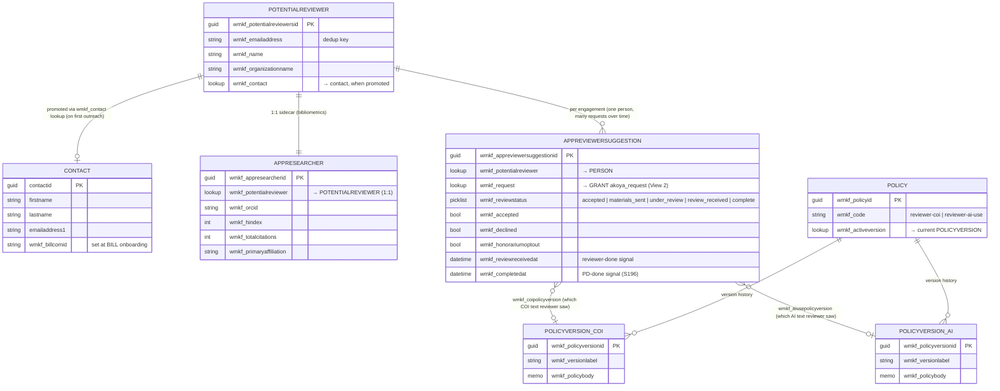
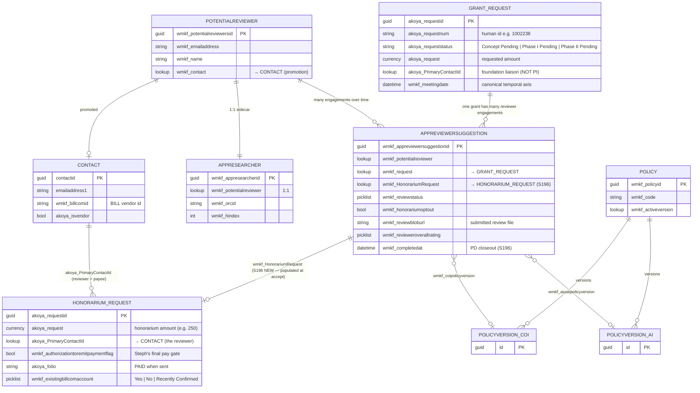
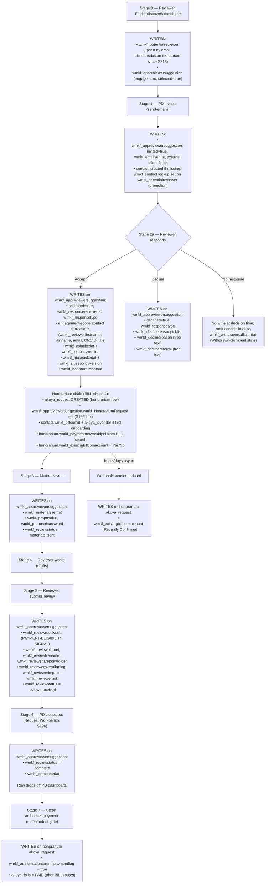

# Reviewer Data Model

Visual orientation for the reviewer-domain Dataverse entities and how they connect. Use this when you're not sure which entity holds which piece of data, or when a piece of reviewer data is created.

> **Authoritative source for any single entity is its atlas page** (`docs/atlas/dataverse-*.md`). This doc summarizes the connections; the atlas pages have the per-field detail.

---

## Entities at a glance

| Entity | What it is | When the row appears | Row count |
|---|---|---|---|
| `wmkf_potentialreviewer` | The **person**. Custom Foundation entity (not vendor). Global. One row per real human, dedup'd on email. Row origin tracked in `wmkf_source` — currently two main paths: (a) **Reviewer Finder** discovery (rich enrichment, full bibliometrics), (b) **Applicant-submitted** during application intake (sparse: usually just name + affiliation + email). The same person can later be enriched if Reviewer Finder picks them up, or via the Workbench "enrich recommended reviewers" action (S211). | First touch by either path. | 4,267 |
| ~~`wmkf_appresearcher`~~ | **DROPPED S213** — the bibliometric sidecar (h-index, ORCID, citations, scholar URL) was collapsed onto `wmkf_potentialreviewer`. Those fields now live on the person; written by Reviewer Finder enrichment + the Workbench "enrich recommended reviewers" action. See "What changed" below. | — |
| `contact` | The **CRM contact**. Where canonical identity ultimately lives. | Promoted from `wmkf_potentialreviewer` on first staff outreach. | (vendor table — many) |
| `wmkf_appreviewersuggestion` | The **per-(reviewer, request) engagement**. Lifecycle ledger — every state, timestamp, decline reason, policy ack, review content lives here. | Reviewer Finder save-candidates creates one per (person, request). | 336 |
| `akoya_request` (grant) | The **proposal being reviewed**. | Created when WMKF intakes a grant request. | 25,473+ |
| `akoya_request` (honorarium) | The **payment to the reviewer**. Same entity class as the grant, distinct row-purpose. | Created at reviewer accept time by the portal (BILL chunk 4). | (subset of the same 25,473) |
| `wmkf_policy` / `wmkf_policyversion` | Versioned policy text (COI, AI use). | Staff edits in admin UI. | 2 / 8 |

---

## View 1 — Reviewer-domain only

### The minimum picture: who the reviewer is, the engagement, the bibliometric sidecar, policy acks. No grant, no honorarium.

---

## View 2 — Expanded: + grant request + honorarium request

Adds the two `akoya_request` flavors (the grant being reviewed and the honorarium paying the reviewer) so you can see how the engagement spans both.

**Note on the two `akoya_request` flavors.** Both `GRANT_REQUEST` and `HONORARIUM_REQUEST` are the SAME Dataverse entity (`akoya_request`). They're distinguishable only by their field values — primarily `akoya_program`, `wmkf_grantprogram`, and `wmkf_type`. The new `wmkf_HonorariumRequest` lookup on `wmkf_appreviewersuggestion` exists precisely so we don't have to infer the grant↔honorarium relationship by data-mining; it's recorded explicitly at create time.

---

## Lifecycle write-paths

When does each entity get touched? Stages mirror `docs/REVIEWER_INTERACTION_DESIGN.md`.

---

## "Where do I look for X?" reference

| Question | Entity / field | Notes |
|---|---|---|
| Reviewer's canonical name + email | `contact` (post-promotion) or `wmkf_potentialreviewer` (pre-promotion) | Promotion happens on first outreach via `wmkf_potentialreviewer.wmkf_contact` |
| Reviewer's engagement-scope corrections (they updated their email at accept) | `wmkf_appreviewersuggestion.wmkf_revieweremail` etc. | Engagement-scoped — never auto-promoted to contact or person record |
| h-index / citation count / ORCID / scholar URL | `wmkf_potentialreviewer.wmkf_hindex` etc. | on the person (S213; was the `wmkf_appresearcher` sidecar) |
| Accept/decline state | `wmkf_appreviewersuggestion.wmkf_responsetype` (picklist) + `.wmkf_accepted` / `.wmkf_declined` booleans | |
| Decline reason | `wmkf_appreviewersuggestion.wmkf_declinereasonpicklist` (structured) + `.wmkf_declinereason` (free text) + `.wmkf_declinereferral` | |
| COI / AI policy acknowledged? | `wmkf_appreviewersuggestion.wmkf_coiackedat` (timestamp) + `wmkf_coipolicyversion` (which version they saw) | Same shape for AI-use |
| Honorarium opt-out | `wmkf_appreviewersuggestion.wmkf_honorariumoptout` | |
| The honorarium row for a reviewer engagement | `akoya_request` via `wmkf_appreviewersuggestion.wmkf_HonorariumRequest` | S196-new link; one hop |
| Honorarium amount | `akoya_request.akoya_request` (on the honorarium row) | Field name = entity name. Yes, confusing. |
| Is payment authorized? | `akoya_request.wmkf_authorizationtoremitpaymentflag` (honorarium row) | Steph's manual final gate |
| Has payment been sent? | `akoya_request.akoya_folio = 'PAID'` (honorarium row) | NOT `akoya_paymentsent` — empirically not a payment gate |
| BILL vendor id for a reviewer | `contact.wmkf_billcomid` | Set at first BILL onboarding, reused next cycle |
| BILL network state | `akoya_request.wmkf_exisitngbillcomaccount` (honorarium row, sic spelling) | Yes / No / Recently Confirmed |
| Submitted review file | `wmkf_appreviewersuggestion.wmkf_reviewbloburl` + `.wmkf_reviewfilename` + `.wmkf_reviewsharepointfolder` | |
| Reviewer's overall rating | `wmkf_appreviewersuggestion.wmkf_revieweroverallrating` (picklist) | Companions: `wmkf_reviewerimpact`, `wmkf_reviewerrisk` |
| External access token (magic link) | `wmkf_appreviewersuggestion.wmkf_externaltokenhash` + `.wmkf_externaltokenissued` / `expires` / `revoked` | Stored as HMAC hash, never plaintext |
| Has PD closed out the review? | `wmkf_appreviewersuggestion.wmkf_reviewstatus = complete` AND `.wmkf_completedat` set | S196-new |
| The grant being reviewed | `wmkf_appreviewersuggestion.wmkf_request → akoya_request` (the GRANT row) | |
| Where the reviewer was found | `wmkf_potentialreviewer.wmkf_source` (lead origin: Reviewer Finder vs applicant-submitted vs other) + `wmkf_appreviewersuggestion.wmkf_sources` (this-engagement provenance) | |

---

## What changed

**`wmkf_appresearcher` collapse — ✅ SHIPPED S213 (2026-06-02).** The bibliometric sidecar was structural redundancy (split off to keep h-index refreshes from churning the identity row, but with no historical-snapshot need and `wmkf_potentialreviewer` confirmed custom-not-vendor, the fields belonged on the person). It was collapsed: 17 bibliometric fields added to `wmkf_potentialreviewer`, all 339 sidecar rows backfilled onto their persons, `adapters/researcher.js` repointed to write the person, callers cut over, and `wmkf_appresearcher` + the two empty `wmkf_apppublication`/`wmkf_apppublicationauthor` tables **DROPPED**. Bibliometrics (affiliation/h-index/citations/ORCID/scholar/etc.) now live directly on `wmkf_potentialreviewer`. As-executed record: `docs/APPRESEARCHER_COLLAPSE_PLAN_V2.md` (the S196 `docs/APPRESEARCHER_COLLAPSE_PLAN.md` is the original design). **The two ER diagrams above + the entity table predate the collapse — read the `APPRESEARCHER` entity there as folded into `POTENTIALREVIEWER`.**

---

## Naming gotchas

- **`wmkf_potentialreviewers` (plural) is the entity logical name.** Most docs (including this one) write it as `wmkf_potentialreviewer` (singular) for readability. The OData API requires the plural form. This trips up new probe scripts — query `EntityDefinitions(LogicalName='wmkf_potentialreviewers')`, not `wmkf_potentialreviewer`.
- **`akoya_request.akoya_request` (entity-name-as-field-name)** is the currency field for "requested amount" — applies to both grant and honorarium rows.
- **`wmkf_exisitngbillcomaccount`** is misspelled in Dataverse (`exisitng` not `existing`). Do not "fix" it in queries.
- **`wmkf_appreviewersuggestion` (singular) is the entity logical name; entity-set is `wmkf_appreviewersuggestions` (plural).** OData URLs use the plural form.
- **Two `akoya_request` flavors live in one table.** Grant vs honorarium is a row-shape distinction, not a table distinction. Discriminator fields: `akoya_program`, `wmkf_grantprogram`, `wmkf_type`.

---

## See also

- `docs/atlas/dataverse-wmkf-appreviewersuggestion.md` — engagement junction (the central row)
- `docs/atlas/dataverse-wmkf-potentialreviewers.md` — person record
- (bibliometric fields now live on `docs/atlas/dataverse-wmkf-potentialreviewers.md` — the `wmkf_appresearcher` sidecar + its atlas page were dropped S213)
- `docs/atlas/dataverse-wmkf-policy-and-policy-version.md` — policy versioning
- `docs/atlas/dataverse-akoya-request.md` — grant + honorarium row shape
- `docs/REVIEWER_INTERACTION_DESIGN.md` — full reviewer-journey design
- `docs/BILL_HONORARIUM_INTEGRATION_DESIGN.md` — honorarium creation + BILL onboarding
- `docs/INTAKE_PORTAL_SCHEMA_CHANGES.md` — running audit of schema-creation history
