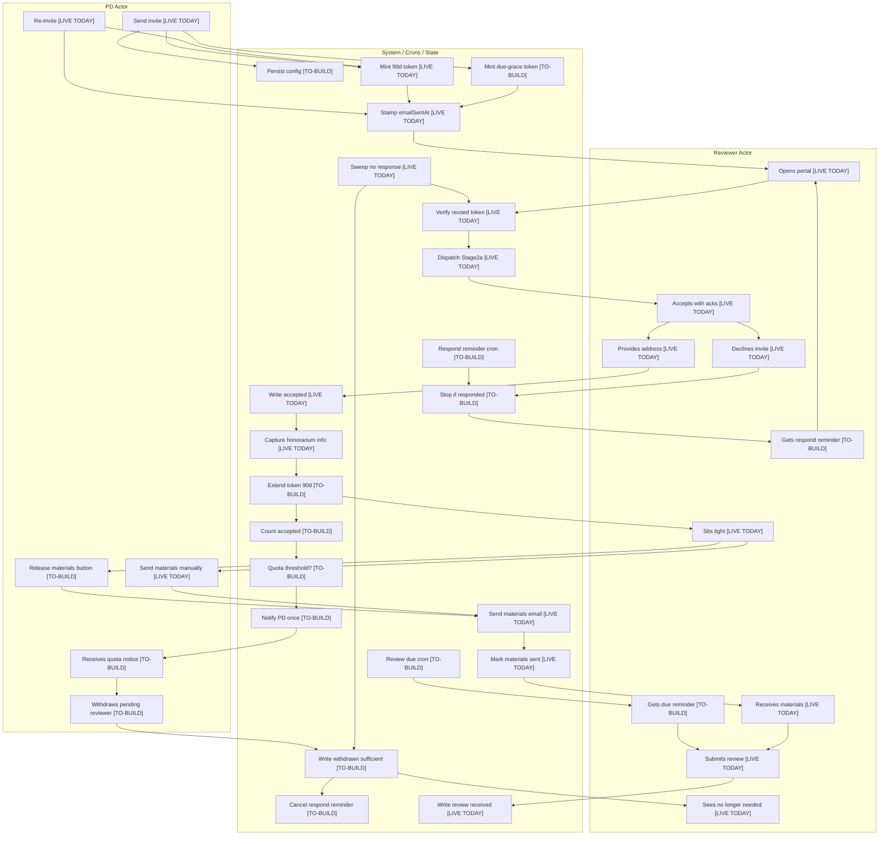

# Reviewer Engagement Plan Interpretation

## Mermaid Flowchart

## Open Questions / Ambiguities / Gaps

1. Quota counting needs exact semantics: count only currently accepted reviewers, or include materials-sent, submitted, held, opted-out, withdrawn, and later-flipped reviewers?

2. Quota notification race handling is unclear: simultaneous accepts could cross the threshold twice unless the "notify PD once" state is persisted atomically.

3. Respond-by reminder behavior after the deadline is ambiguous: should a missed lead window still send late, or should reminders stop once the response deadline passes?

4. Respond-by reminder persistence needs a separate marker because today's `wmkf_remindersentat`/count are used for review follow-up reminders.

5. Token extension timing is underspecified: a signed JWT's expiry cannot truly be extended in place, so accepting likely requires minting a replacement token and deciding how the reviewer receives or navigates to it.

6. Multi-wave re-invite rules need detail: re-stamped `emailSentAt` should re-arm respond reminders, but it is unclear whether it also re-mints tokens, resets prior reminder markers, or preserves campaign config.

7. Campaign config editability is undefined after invite send: the plan needs where PDs edit respond offset, review due, reminder settings, and desired count, plus whether edits affect already-invited reviewers.

8. `withdrawn_sufficient` and honorarium interaction is unclear: it should target pending reviewers, but the plan should state whether it blocks honorarium/payment work if applied to an already accepted row by mistake.

9. `sweep-stale-invites` may conflict with new token TTL policy: meeting-date-based no-response closure and review-due-based token expiry can disagree unless one becomes authoritative.

10. Materials release needs a server-side accepted-only gate: the new PD button wraps the live manual materials send, but the plan should specify whether non-accepted selected reviewers are skipped or rejected.

11. Review-due reminders need target refinement: "accepted but not submitted" could include accepted-pre-materials reviewers who have not yet received materials.

12. The plan does not specify the durable schema for campaign config, quota-notified state, respond-reminded state, or per-request desired count.

13. Existing render behavior can mint a fresh external link whenever `{{externalLink}}` appears, so reminder templates must be constrained if the intended model is one reused engagement token.

14. `scripts/cron/` was [NOT FOUND]; live cron code is under `pages/api/cron/`, so the implementation target should be named consistently.
