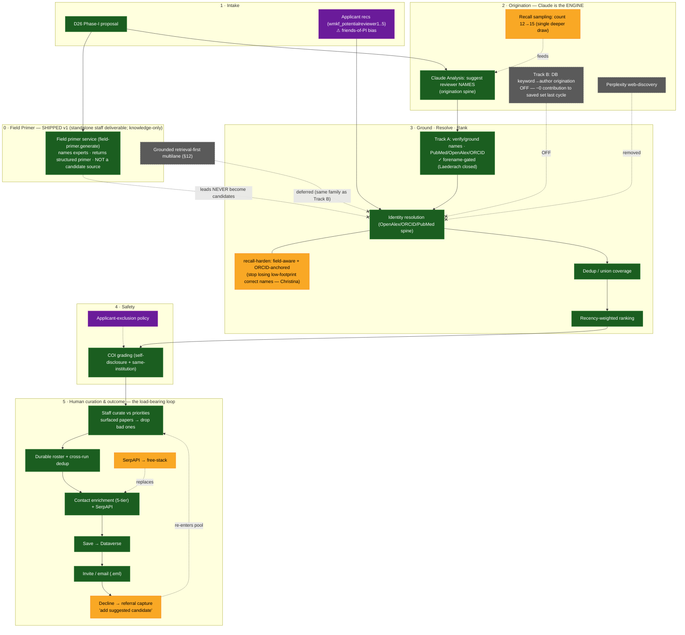

# D26 Reviewer-Finding Pipeline — Flowchart & Status

Date: 2026-06-12

Operational plan for finding appropriate reviewers for the **D26 Phase-I** cycle,
with each pipeline stage marked by status. Direction reflects the **S246 forward
sniff-test experiment** ("Claude-assisted wins" gate) plus the attribution probes and
corrected-posture reconciliation worked out this session.

The core posture: **Claude is the origination engine** (recall-oriented, human-curated);
the grounded-*origination* family (Track B keyword→author, and the retrieval-first
multilane) is **parked**; the real leverage is **downstream** — identity-resolution
recall, human curation, and the decline→referral loop.

Sources: `docs/REVIEWER_FINDER_ORIGINATION_PLAN.md`,
`docs/REVIEWER_FINDER_ORIGINATION_EXPERIMENT_2026-06-12.md`,
`docs/REVIEWER_FINDER_RETRIEVAL_REDESIGN_PLAN.md`,
`docs/agent-wiki/topics/reviewer-origination.md` (genesis & corrected posture),
`docs/agent-wiki/topics/reviewer-identity.md` (namesake-collision worked example),
`docs/REVIEWER_FINDER.md`.

## Flowchart

**Legend** — 🟩 green = exists/shipped · 🟨 amber = needs building/fixing (incl. the
Track-B disable, a change item) · 🟪 purple = open policy decision · ⬛ gray/dashed-X =
off / abandoned / deferred (don't wire in).

## What's settled (S246 + this session)

- **Claude-assisted origination is the engine.** S246's "Claude-assisted wins" gate
  fired for the D26 Phase-I cohort. Keep the Claude spine; defer the retrieval-first
  inversion.
- **Track B is OFF.** It contributed ~0 to the saved set last cycle (origination plan
  §1: `scholarly-only-saved ≈ 0`, by construction — pre-resolution dedup + identity
  budget + save-gate). Claude alone supplies enough candidates even at count=12.
  Disabling it is a real code change in `discover.js` / `discovery-service.js`.
- **The weak link is downstream identity resolution, not origination.** The
  attribution probes showed it: the plant-virologist noise was a *grounded-arm*
  artifact (Claude named zero); the Christina case showed origination found a real,
  relevant person that *resolution* lost (namesake collision + fragmentation).
- **The Laederach class is closed.** Track-A verify now demotes a hallucinated forename
  to `UNRESOLVED` (forename gate, empirically confirmed), then the identity gate blocks
  it from save/select.

## Stage 0 · Field Primer (SHIPPED v1, S248 — standalone staff deliverable, knowledge-only)

A standalone, staff-facing overview of the proposal's research field (what it is,
sub-areas, methods, frontiers, communities, venues, **named experts**, where the proposal
sits). **Built S248** as a service through the shared Executor:

- **Service** `lib/services/field-primer-service.js` → **Executor** prompt
  `field-primer.generate` (Dataverse `wmkf_ai_prompts`, sonnet). Callable from a route now
  or an earlier-in-process step later (all-override prompt — proposal text in, no requestId).
- **Route** `POST /api/field-primer/generate` (`requireAppAccess('reviewer-finder')`);
  **CLI** `scripts/generate-field-primer.mjs` → markdown for this cycle (no UI yet).
- **Decoupled from candidates** — output target `kind:'none'` (returned, not persisted);
  **no** discovery/save/COI write path. This is why it **may name experts** (decided with
  Justin, S248): the redesign plan's "primer never names people" boundary is really
  *"never CREATES CANDIDATES"* — naming experts in staff prose doesn't breach it. Output is
  labeled "orienting field review — not vetted reviewer suggestions."
- **A7**: proposal text declared `untrusted` → Executor wraps + injects the preamble.

**Roles — decided (S248):** standalone PD deliverable is the live role; the query-seed
*scaffold* role stays coupled to the deferred retrieval-first redesign. **v1 is
knowledge-only** (no web); a web-grounded literature-search increment is a **next-cycle
follow-up**. Named experts are model-knowledge (real but unvetted; staleness/fame-bias
flagged in the primer's own caveats).

**v2 priority — expert-name grounding (concrete failure observed S248).** On the real
1002878 run, the primer named **"Oksana Zhaxybayeva"** — the right surname, institution,
and field (computational GTA biology) but a **hallucinated forename**: the real researcher
is **Olga Zhaxybayeva** (OpenAlex: 151 works; "Oksana Zhaxybayeva" → 0 results). This is
the same forename-hallucination class as the Laederach verify bug, but the knowledge-only
primer has **no verification step**. The v2 fix is an **expert-grounding pass reusing the
existing identity spine** (`reviewer-identity-resolver` / `OpenAlexService`): resolve each
named expert — exact name resolves → confirm; name fails but **surname + field** resolves
unambiguously → correct the forename from the record (or flag); ambiguous / common surname
→ **flag "unverified," never auto-correct to a namesake** (the Christina lesson). v1 stopgap
(shipped S248): the prompt now warns explicitly that names — including first names — may be
wrong and must be verified. **Confirmed the stopgap does NOT stop the hallucination** — a
re-run still produced "Oksana," and the model's own caveat shows Zhaxybayeva is a **Co-PI
named in the proposal text**, so the correct forename was *in the input* and the model still
overrode it from memory. Knowledge-only generation can't reliably copy a name from the
document in front of it → grounding (cross-check expert names against the proposal's named
personnel AND OpenAlex/ORCID) is the only real fix; the caveat just makes the labeling honest.

## 🟩 What exists today (live pipeline)

- **Claude Analysis** + name suggestion (`analyze.js`) — the origination engine
- **Track A — verify/ground** Claude's names against PubMed/OpenAlex/ORCID,
  **✓ forename-gated** (the Laederach failure is closed)
- **Identity resolution** on the OpenAlex/ORCID/PubMed spine + **dedup/union coverage**
- **Recency-weighted ranking** (S224: recency > citations, current-affiliation pinning)
- **COI grading** (S240: self-disclosure + current same-institution)
- **Human curation** — staff select against priorities, using each candidate's surfaced
  papers to drop the occasional bad one (the load-bearing, human-in-the-loop step)
- **Find-tab durable roster** with cross-run dedup (S224)
- **Contact enrichment** (5-tier), **save to Dataverse**, **email/.eml generation**
- Admin-configurable **search time budget** (S223)

## 🟨 What needs building/fixing (the leverage is downstream)

1. **Identity-resolution recall hardening** — field-aware + ORCID-anchored resolution so
   low-footprint *correct* names aren't lost to famous namesakes (the Christina case).
   Highest-leverage, and it's an *identity* fix, not an origination one.
2. **Recall sampling — single deeper draw (count 12→15), NOT extra calls.** Claude is
   consistent at temp 0.3, so re-drawing returns the same head (wasted call); a deeper
   single draw walks further down the same ranked list and surfaces tail names in one
   call. 39/50 of applicants' own recommended reviewers were found by neither path — a
   *magnitude* signal that the pool is shallow (not a target to chase; the applicant
   list carries friends-of-PI bias). Watch the padding ceiling (the S231 probe saw
   1003063 padded to 17 with hallucinated entries) — validate 15 returns real names
   before going higher. This is the recall lever (replacing Track B).
3. **Referral capture** ("add suggested candidate") — a declining reviewer's free-text
   suggestion → resolved candidate; reuse manual-add (S236) + identity spine with
   abstain-or-confirm safety. One of the three signals that made last cycle work.
4. **Disable Track B** — remove the DB keyword→author origination lane from the
   production parallel path (it ran but contributed ~0 to saved panels).
5. **SerpAPI → free-stack migration** — $150/mo, value eroded; 4 of 6 uses replaceable.
6. **Verify-loop latency — MEASURED, not the bottleneck (deprioritized).** Profiled
   `verifyClaudeSuggestions` on the real 1002878 Arm-A names
   (`scripts/profile-reviewer-verify.mjs`, live PubMed/OpenAlex): ~2.8s/candidate
   sequential, **42.8s for 15 / 34.5s for 12 — the 12→15 bump costs only +8.4s**, far
   under the 600s budget. So the Track-A verify loop is *not* the 10-min risk, and
   parallelizing it (bounded concurrency, pattern exists in `discovery-service.js`) is a
   nice-to-have, not urgent. The real post-Claude latency lever is **Track-B-off**, now
   **MEASURED at ~27s** (≈3× a Track-A-only run; `scripts/profile-trackb-ab.mjs` A/B:
   7 queries → 147 discovered, top-24 resolved through the OpenAlex/ORCID spine before
   the 25 cap). STILL UNMEASURED end-to-end:
   analyze wall-clock (~50s est.), OpenAlex publication backfill, and contact
   enrichment / SerpAPI — profile those next if the slowness perception persists.

## 🟪 Open policy / design decisions

- **Applicant-exclusion breadth** — the exclusion is load-bearing (friends-of-PI are the
  one pool biased toward the applicant with no skeptical counterweight; e.g. an applicant
  suggested Benner), but one soft "overlapping programs" line can over-broaden it and
  clobber the peer set. Needs a foundation decision.
- **Field primer** (Stage 0) — roles/shape DECIDED + v1 SHIPPED (S248). Remaining: the
  web-grounded literature-search increment (next cycle) and a UI (CLI-only for now).

## ⬛ Off / don't wire in (abandoned/deferred)

- **Track B (DB keyword→author origination)** — OFF. Noisy on thin signal, ~0 marginal
  recall, ~0 saved-set contribution last cycle. Recall comes from Claude recall-sampling
  + referrals instead.
- **Perplexity web-discovery** (as a *reviewer* source) — abandoned S230 (hallucinated
  reviewers + fabricated affiliations). (Web search for the *field primer* is a
  different, safer use — people-free field map only.)
- **ORCID-works multilane / retrieval-first cutover** — deferred until a
  properly-anchored §12 arm is built *and* judged on live accept/decline. Same parked
  grounded-origination family as Track B; remains valid + unrefuted as a sparse-tail
  tool, just not the engine.
- **COI Chunk 2b** (retire `POTENTIAL_CONCERNS`) — destructive carryover, deferred/unverified.
