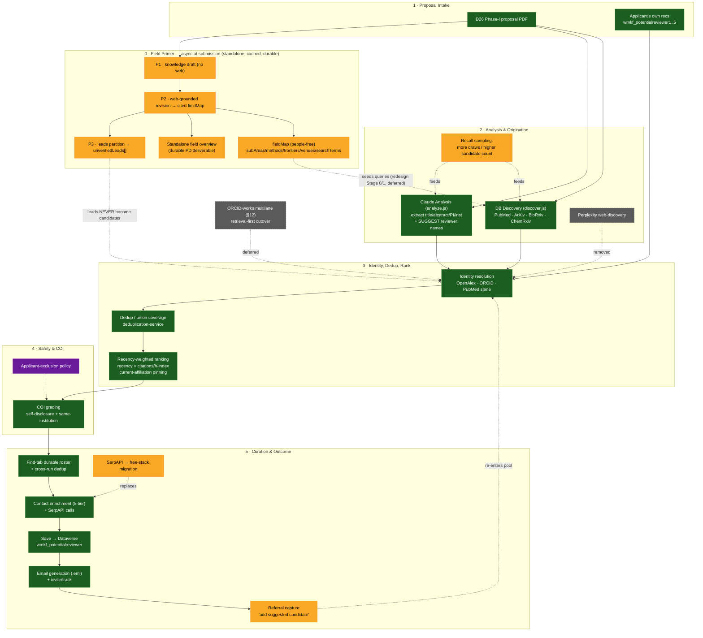

# D26 Reviewer-Finding Pipeline — Flowchart & Status

Date: 2026-06-12

Operational plan for finding appropriate reviewers for the **D26 Phase-I** cycle,
with each pipeline stage marked by status. Direction reflects the **S246 forward
sniff-test experiment**, which fired the "Claude-assisted wins" gate for this cohort.

Sources: `docs/REVIEWER_FINDER_ORIGINATION_PLAN.md`,
`docs/REVIEWER_FINDER_ORIGINATION_EXPERIMENT_2026-06-12.md`,
`docs/REVIEWER_FINDER_RETRIEVAL_REDESIGN_PLAN.md` (Part B + Part C — the field primer),
`docs/agent-wiki/topics/reviewer-origination.md`, `docs/REVIEWER_FINDER.md`.

## Flowchart

**Legend** — 🟩 green = exists/shipped · 🟨 amber = needs building/fixing (the
experiment says invest here) · 🟪 purple = open policy decision · ⬛ gray/dashed-X =
built-but-abandoned or deferred (don't wire in).

## What's settled (the S246 decision)

The forward sniff-test experiment fired the **"Claude-assisted wins" gate** for the
D26 Phase-I cohort. The **spine stays Claude-assisted origination** (the green path:
Claude suggests names + DB discovery, then resolve/dedup/rank). The retrieval-first
**ORCID-works multilane (§12)** cutover is **deferred** — not refuted, just not yet
built against a properly-anchored arm and not yet judged on real accept/decline.

## Stage 0 · Field Primer (DECIDED — buildable now, NOT BUILT)

The field primer is a **structured, cited review of the proposal's research field** —
what the field is, its sub-areas, key methods, current frontiers, active research
communities, and notable venues, each claim tied to a resolvable source. It has two
roles:

1. **Standalone PD deliverable (direction-independent).** A non-specialist program
   director gets an orienting field map — valuable *on its own*, even when reviewer
   yield is thin (thin Phase-I narrative, or a proposal whose best peers all
   self-excluded). It degrades gracefully and is **not** gated behind the deferred
   retrieval-first cutover.
2. **Scaffold** for query/source planning: its people-free `fieldMap` may seed
   queries — but is **never** a candidate source.

Decided design (Part B + Part C §1):

- **Async pre-compute at submission**, stored as a cached durable artifact — out of
  the synchronous reviewer-finder latency budget entirely.
- **Staged:** P1 knowledge draft (no web) → P2 web-grounded revision → cited
  `fieldMap` → P3 partition any named people into `unverifiedLeads[]`.
- **Hard, code-enforced boundary:** the primer **never creates candidate reviewers**.
  `fieldMap` (people-free: `subAreas/methods/frontiers/venues/searchTerms`) may seed
  queries; `unverifiedLeads[]` is never a candidate field. A lead may at most become a
  grounded-seed query that must ground-or-drop through PubMed/ORCID/OpenAlex —
  affiliation/contact always from the verified record, never the primer prose.
- **Neutral, accurate field map.** Lay out the field's mainstream structure plainly;
  do NOT editorialize "heterodox/divergent perspectives" (the critical function is the
  humans'). Directional quality is acceptable — it is one input to a human judgment
  with downstream correctives, not a load-bearing/airtight component.
- **Bias/coverage metric is DEFERRED** — optional, later, narrowed to a
  spread-across-sub-communities redundancy check. **Not** required to ship the primer;
  eyeball-validate first.

First step (de-risk): a shadow, non-candidate-producing prototype on prior proposals —
extraction + people-agnostic primer + query generation → feed only the generated
queries into existing retrieval → compare yield/latency/false-positives. Do **not**
prototype "primer names people" first.

## 🟩 What exists today (live pipeline)

- **Claude Analysis** + name suggestion (`analyze.js`) — the origination spine
- **DB Discovery** across PubMed/ArXiv/BioRxiv/ChemRxiv (`discover.js` / `discovery-service.js`)
- **Identity resolution** on the OpenAlex/ORCID/PubMed spine + **dedup/union coverage**
- **Recency-weighted ranking** (S224: recency > citations, current-affiliation pinning)
- **COI grading** (S240: self-disclosure + current same-institution)
- **Find-tab durable roster** with cross-run dedup (S224)
- **Contact enrichment** (5-tier), **save to Dataverse**, **email/.eml generation**
- Admin-configurable **search time budget** (S223)

## 🟨 What needs building/fixing (where the experiment says to invest)

1. **Field primer** (Stage 0 above) — DECIDED/buildable; its standalone-deliverable
   role is direction-independent.
2. **Recall sampling** — more `analyze` draws / higher candidate count. The
   experiment's sharpest finding: **39/50 of applicants' own recommended reviewers
   were found by *neither* arm** — people are lost to undersampling regardless of
   direction. Highest-leverage origination fix.
3. **Referral capture** ("add suggested candidate") — a declining reviewer often
   free-texts a colleague; reuse manual-add (S236) + identity spine with
   abstain-or-confirm safety. Validated as how panels actually fill perspective gaps
   (1002379: Doyle → referred Newhouse).
4. **SerpAPI → free-stack migration** — $150/mo, value eroded; 4 of 6 uses
   replaceable with free academic APIs.

## 🟪 Open policy decision

- **Applicant-exclusion breadth** — the applicant-suggested-reviewer exclusion is
  load-bearing (friends-of-PI are the one pool biased toward the applicant with no
  skeptical counterweight), but one soft "overlapping programs" line can over-broaden
  it and clobber the peer set. Needs a foundation decision before it's wired into the
  COI/exclusion gate.

## ⬛ Don't wire in (abandoned/deferred)

- **Perplexity web-discovery** (as a *reviewer* source) — built S225–S227, then
  **abandoned S230** (verifiably hallucinated reviewers + fabricated affiliations). UI
  option removed. (Note: web search for the *field primer* is a different, safer use —
  it produces a people-free field map, never named candidates.)
- **ORCID-works multilane / retrieval-first cutover** — deferred until a
  properly-anchored §12 arm is built *and* judged on live accept/decline.
- **COI Chunk 2b** (retire `POTENTIAL_CONCERNS`) — destructive carryover, deferred/unverified.
