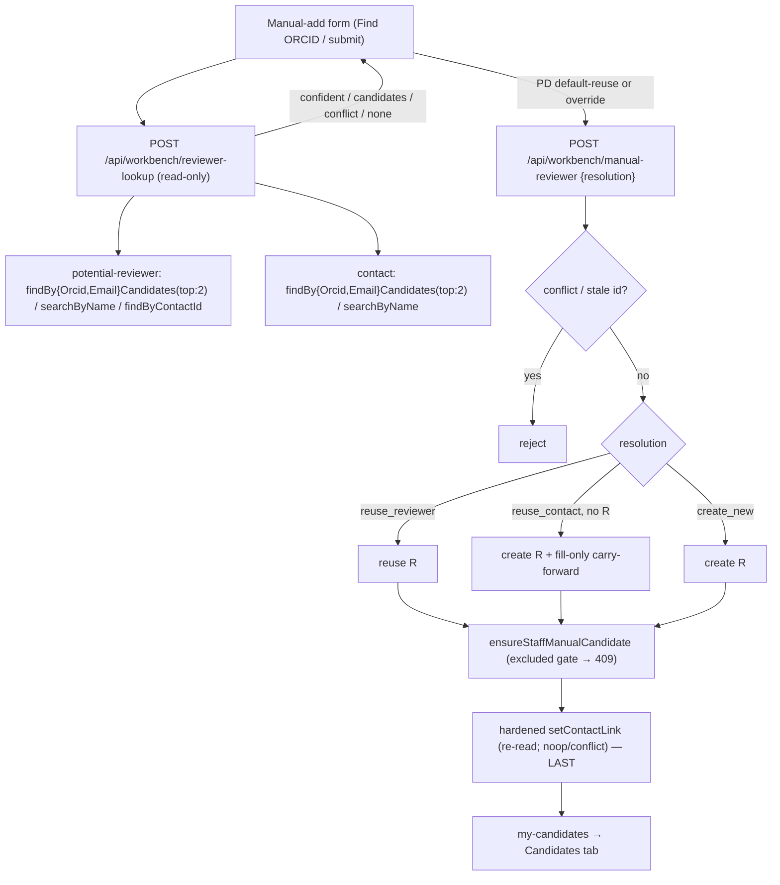

# Reviewer Manual-Add Cross-Store De-duplication Design

> **Status (updated S253, 2026-06-13): SHIPPED.** Cross-store dedup is live in the Workbench
> manual-add path: `pages/api/workbench/reviewer-lookup.js` (pre-submit lookup) and
> `pages/api/workbench/manual-reviewer.js` (submit-time, line ~136) both call
> `lookupReviewerIdentity` (`lib/services/reviewer-identity-lookup.js`), which performs
> ORCID/email/name cross-store matching with ambiguity + collision handling and resolves to
> `reuse_reviewer` / `reuse_contact` / `create_new`. Read the design below as historical rationale;
> re-verify any specific sub-item (NF1–NF3) against source before treating it as open.
> Original status: PROPOSED (S237), rev3 — second Codex pre-impl pass folded (NF1–NF3).
> Extends the shipped Phase-1 manual add (`docs/REVIEWER_MANUAL_ADD_DESIGN.md`).
> Live-state claims are marked `[VERIFIED via X]`; design choices are `[PROPOSED]`.
>
> **Objective:** When a program director (PD) manually adds a reviewer, check
> whether that person already exists in our data **before** minting a new record —
> across **both** stores a reviewer can live in (`wmkf_potentialreviewer` and CRM
> `contact`) — and reuse / link the existing identity instead of creating a
> duplicate. A former PI who is already a `contact`, or a reviewer promoted to a
> `contact` on a prior cycle, must be recognized.

## Why

Manual add (and the normal search-save path) dedupe on **exact email only**, so
a name-only add, or an add for someone whose stored record carries a different /
blank email, mints a fresh person — fragmenting identity. Within the pool, **23
of 24 duplicate humans would be missed by email** and are caught only by ORCID
([VERIFIED via memory `reviewer-identity-fragmentation`, S216 read-only probes]).
A person also routinely exists as a `contact` independent of the reviewer pool
(GOapply auto-creates contacts; a former PI is a contact with no reviewer row),
so a reviewer-pool-only check still creates duplicates and misses the existing
CRM identity. This is a **flow problem** — reuse existing identity machinery and
let the shared key (ORCID) build over time — not a one-shot collapse.

## Scope

- **In scope:** the Workbench manual-add surface only (`pages/api/workbench/manual-reviewer.js`
  + `shared/components/reviewers/ReviewerFindPanel.js`). [Decision: "Manual-add only"]
- **Out of scope (deferred):** lifting the same dedup into the shared
  `upsertByEmail` person-resolution layer so the normal search-save path
  (`pages/api/reviewer-finder/save-candidates.js`) also dedupes.

## Verified Current State

- `[VERIFIED via pages/api/workbench/manual-reviewer.js + lib/dataverse/adapters/potential-reviewer.js:67-125]`
  Manual add resolves the person through `upsertByEmail`, which dedupes **only by
  exact email** (`getByEmail` → `emailaddress1 eq`, **`top:1`**); no email / no
  match → `createRecord`.
- `[VERIFIED via lib/dataverse/adapters/researcher.js:18,25,105-127]` `wmkf_orcid`
  lives on the **same** `wmkf_potentialreviewerses` entity (post-S213 collapse);
  `upsertByPotentialReviewer` writes ORCID / `emailSource` **fill-only**, never
  touches `wmkf_identitystatus`.
- `[VERIFIED via lib/dataverse/adapters/contact.js]` `contact` adapter
  (`ENTITY_SET 'contacts'`) exposes `findByEmail` (**`top:1`**, record|null),
  `findOrCreateByEmail`, `setOrcidIfAbsent`, and crucially **`resolveForBackprop`
  — the existing `top:2` + in-code ambiguity-classification pattern** we will copy.
  `FIELD_SELECT` = `contactid, firstname, lastname, fullname, emailaddress1`. **No
  `findByOrcid`, no name search, and no reverse-link helper on either store.**
- `[VERIFIED via lib/dataverse/adapters/contact.js:117-149]` `contact` has a native
  `wmkf_orcid` field (read+written by `setOrcidIfAbsent`).
- `[VERIFIED via lib/dataverse/adapters/potential-reviewer.js:12-23,182-185]` The
  reviewer→contact link is the forward lookup `_wmkf_contact_value`; `setContactLink`
  is an **unconditional PATCH** with no already-linked check.
- `[VERIFIED via memory `project-contact-promotion-permission`, S213]` App role has
  **Create + AppendTo** on `contact`, **no DeleteAccess** — create/link/read only.
- `[VERIFIED via lib/utils/contact-parser.js:69,484,497]` Name-match helpers are
  **client-side string utilities** (`stripHonorifics`, `normalizeNameForMatch`,
  `namesMatch`) — there is **no normalized-name field** in Dataverse.
- `[VERIFIED via lib/utils/orcid-normalize.js:46]` `normalizeOrcid` validates +
  normalizes (mod-11-2). `[VERIFIED]` The manual-add form already has a read-only
  "Find ORCID" lookup (S237 `strictAmbiguity` path).

## Match-Key Tiers (confidence-ordered, applied across BOTH stores)

| Tier | Key | Reviewer pool | Contact store | Default action |
|------|-----|---------------|---------------|----------------|
| 1 | **ORCID** (typed or via "Find ORCID") | `findByOrcidCandidates` *(new)* | `findByOrcidCandidates` *(new)* | Reuse iff unambiguous |
| 2 | **Exact email** | `findByEmailCandidates` *(new)* | `findByEmailCandidates` *(new)* | Reuse iff unambiguous |
| 3 | **Name (+ affiliation)** | `searchByName` *(new)* | `searchByName` *(new)* | Reuse **only after PD confirms** |

**[F1 — ambiguity-aware, copied from `resolveForBackprop`]** Tier-1/2 helpers are
**`top:2`** and return `{ none } | { one, id } | { ambiguous, count }` after an
**in-code normalized compare** (the authority over Dataverse collation). The
server emits a `confident` result **only when BOTH stores have been checked and
neither returns `ambiguous` for that key.** A duplicate same-key row inside either
store demotes the result to `candidates` (PD chooses).

## Resolution Matrix (what we DO on a hit)

`R` = matching `wmkf_potentialreviewer` row, `C` = matching `contact`.

| Found | Action |
|-------|--------|
| `R` (linked or not) | **Reuse** `R`. If `R` is unlinked **and** a confident `C` is found **and** `C` is not already linked to another reviewer → link them (heal the split). |
| `C` only (no `R`) — **former-PI case** | If confident key (email/ORCID) **and** `C` is not already linked to another reviewer → **create `R` and link to `C`**, pulling `C`'s identity forward fill-only. Name-only → confirm first. |
| `R` and `C`, unlinked | Reuse `R`; link to `C` **iff** `C` not already linked elsewhere. |
| Neither | **Create new** `R` (today's behavior). |
| **CONFLICT** (any of below) | **No auto-default. Surface a conflict; PD must resolve (pick a target or create-new). Server rejects an unresolved-conflict submit.** |

**[F2 — conflict + reverse-link]** `conflict` is reserved for **cross-store
contradictions and reverse-link collisions** — cases with no single list to pick
from. Conflict cases that must NOT auto-resolve:
- ORCID matches `R`, but email matches a **different** `C` (or vice-versa) — an
  authoritative cross-store split (Q4).
- The target `C` is **already linked to a different reviewer row** (detected by the
  new `potentialReviewerAdapter.findByContactId(contactId)` reverse-link helper).
- **[NF3]** On `reuse_contact`, a non-empty PD-typed email that **differs from the
  matched contact's `emailaddress1`** — email is a Tier-2 identity key, so a
  mismatch means we may have the wrong contact.

**[NF1 — ambiguous-key is NOT a conflict]** A duplicate **same-key** row *within a
single store* (two rows sharing the typed email/ORCID) → **`candidates`**, not
`conflict`. It is a "which of these is the right person" pick, which the
candidates + PD-confirm UI handles. `conflict` is only the cross-store / reverse-
link cases above. The Resolution Matrix, API `outcome`, submit validation, and
tests all follow this single rule.

## Decisions (from review with the PD, S237)

- **Q1 — Default to the existing record, PD overrides.** On a single confident
  match the form **pre-selects "use this existing person"** + context; the PD acts
  only if it's the wrong human. Presentation scales with confidence (default stays
  reuse): ORCID/email quiet; **name-only** carries a visible "verify this is the
  same person" emphasis. **One** confident match → default to it. **Multiple
  plausible / ambiguous / conflict** → no auto-default; show the short list, PD
  picks or create-new.
- **Q2 — ORCID auto-match surfaced + name-guarded + stale-invalidated.** Reuse on
  an ORCID hit, show "reusing existing person matched by ORCID", **downgrade to
  confirm if `nameConsistent === false`** (guards ~14 malformed/mis-attached
  contact ORCIDs). **[F3]** The client MUST invalidate any auto-filled ORCID **and**
  any chosen lookup resolution whenever `name`, `email`, or `affiliation` changes
  after a lookup — a stale ORCID must never silently drive a reuse.
- **Q3 — Contact-only (former PI):** auto create-and-link on a **confident** key;
  **confirm** on name-only. Carry contact fields forward fill-only; PD-typed values
  win — **except** a typed ORCID that conflicts with `contact.wmkf_orcid` is a
  **conflict**, not a silent overwrite (F7).
- **Q4 — When the check runs:** folded into the **"Find ORCID" button** + an
  email/name check **on submit** (not per-keystroke). Cap top ~5; affiliation
  narrowing **deferred** on contacts until the org field is Atlas-verified (F4/F6).
- **Q5 — Inactive / junk contacts:** surface but **badge** + rank below active;
  show email / ORCID / active context. Never auto-reuse a junk row without confirm.

## API Design

### `POST /api/workbench/reviewer-lookup` `[PROPOSED]` (new, read-only)

Request: `{ name, email?, affiliation?, orcid? }`
Response one of:
```json
{ "outcome": "confident",
  "match": { "reviewerId": "…|null", "contactId": "…|null", "matchKey": "orcid|email",
             "nameConsistent": true, "context": { "name": "…", "email": "…", "affiliation": "…", "active": true, "hasOrcid": true, "cycleHint": "…|null" } } }
{ "outcome": "candidates",
  "candidates": [ { "source": "reviewer|contact|linked", "matchKey": "name|email|orcid",
                    "reviewerId": "…|null", "contactId": "…|null", "context": { … } } ] }   // top ~5
{ "outcome": "conflict", "reason": "orcid_email_split|contact_linked_elsewhere|email_mismatch|orcid_mismatch",
  "details": { … } }                                                                          // cross-store/reverse-link/typed-vs-stored; PD must resolve
{ "outcome": "none" }
```
- `requireAppAccess(req, res, 'reviewer-finder', 'reviewers')`. **No writes, no
  third-party calls.** `confident` requires both stores checked, no `ambiguous`,
  no conflict.

### `POST /api/workbench/manual-reviewer` `[PROPOSED]` (extend)

Add optional explicit `resolution { mode: 'reuse_reviewer'|'reuse_contact'|'create_new', reviewerId?, contactId? }`.

Server contract:
- **[F3] Tier-1/2 may auto-resolve server-side only when narrow:** single
  unambiguous match in both stores, `nameConsistent !== false`, **no conflict**.
  Otherwise it must NOT proceed without an explicit `resolution`.
- **Tier-3 name reuse REQUIRES an explicit `reviewerId`/`contactId`** — the server
  never reuses a name-only match on its own.
- `mode = reuse_contact` with no existing `R` → create `R`, pull `C` fields forward
  fill-only, then link (see write-order below).
- Validate supplied ids resolve to real rows; **reject** stale ids and any
  unresolved conflict.
- Identity-bearing writes still happen **after** the per-request exclusion gate
  (S237 finding 4) and remain **fill-only** (S237 finding 5).

**[F5] create-and-link write order + safety (final-step linking):**
1. create `R` (or reuse), 2. `ensureStaffManualCandidate` (exclusion gate → 409),
3. fill-only carry-forward via `upsertByPotentialReviewer`, 4. **link last** via a
hardened `setContactLink`: **re-read `R`** → noop if already linked to the same
`C`; **conflict** if linked to a different `C`; **conflict** if `C` is already
linked to another reviewer (`findByContactId`). Retry after "R created, link
failed" re-reads and heals; it never blind-overwrites a link.

## New Adapter Helpers `[PROPOSED]`

- `potential-reviewer.findByEmailCandidates(email)` / `findByOrcidCandidates(orcid)`
  — `top:2` + in-code normalized compare → `{none|one|ambiguous}` (F1).
- `contact.findByEmailCandidates(email)` / `findByOrcidCandidates(orcid)` — same.
- `potential-reviewer.findByContactId(contactId)` — reverse-link check (F2),
  `_wmkf_contact_value eq …` (pattern already used in `contact-history.js`).
- `*.searchByName(name, { top })` on **both** stores — **[F4] structured fields,
  not `fullname`:** `lastname eq/startswith <last>` + `startswith(firstname,<first>)`
  (reviewer: `wmkf_lastname`/`wmkf_firstname`), `top:5`, then **post-rank in code
  with `ContactParser.namesMatch`**; `contains(fullname,…)` is fallback-only.
  Escape with the existing `escapeOdataString`.
- Harden `setContactLink` with the re-read/compare contract (F5).
- Extend `contact` `FIELD_SELECT` with `wmkf_orcid`, `statecode` (active badge,
  Q5). **Org/cycle fields for contacts are NOT added until Atlas-verified (F6).**

## UI Design (`ReviewerFindPanel.js`) `[PROPOSED]`

- **Find ORCID** → after a confident ORCID, also call `reviewer-lookup`; render the
  default-reuse card (Q1) on a single confident match.
- **On submit** → call `reviewer-lookup`; `confident` → default reuse + proceed;
  `candidates` → confirm UI (PD picks → sets `resolution`); `conflict` → block with
  the PD-resolve prompt; `none` → create.
- **[F3] Invalidate** any auto-filled ORCID + chosen resolution when `name`/`email`/
  `affiliation` changes after a lookup (extend `updateManual`, which today only
  clears `lookupMsg`). Keep the S237 stale-async snapshot guard too.
- Inactive candidates badged + ranked below active (Q5).

## Hazards / Invariants

- **Namesake (fail-dangerous):** name-tier matches are confirm-only; server refuses
  name-only reuse without an explicit PD id. [[project-reviewer-verify-fail-dangerous]].
- **In-store ambiguity (F1):** `confident` only when both stores are duplicate-free
  for the key; else PD chooses.
- **Reverse-link / cross-store conflict (F2):** never auto-link a contact already
  linked elsewhere; never auto-resolve an ORCID-vs-email split.
- **Stale ORCID on form edit (F3):** invalidate on any identity-field change.
- **Uncurated contacts (Q5):** surface context, badge inactive, never silent-reuse.
- **No-delete:** create / link / read only.
- **[NF2] Orphan-`R` on a 409 is intentional, not a leak.** `reuse_contact` (and
  any create path) creates `R` before the exclusion gate, so an applicant-excluded
  add can leave a durable **unlinked** `R`. This is acceptable and matches today's
  pre-gate person creation (S237): `R` is a real human, exclusion is per-request,
  and a later non-excluded add reuses/links it. No compensation/delete (the role
  can't delete anyway).
- **Fill-only carry-forward (F7):** PD-typed values seed the new `R` create payload
  (blanks filled from `C`); `upsertByPotentialReviewer` handles ORCID/emailSource
  fill-only; a typed ORCID conflicting with `contact.wmkf_orcid` is a conflict, not
  a silent win. Never touches `wmkf_identitystatus`.
- **`wmkf_portaloid` lane:** reviewer linking MUST NOT set `wmkf_portaloid`.

## Caller → Persistence → Consumer Trace



## Implementation Plan

1. Adapter helpers: `findBy{Email,Orcid}Candidates` (top:2) + `findByContactId` +
   `searchByName` (structured) on both stores; harden `setContactLink`; extend
   `contact` FIELD_SELECT (`wmkf_orcid`,`statecode`). Unit tests each.
2. `reviewer-lookup` route + tests (confident/candidates/conflict/none, ambiguity,
   reverse-link, nameConsistent guard).
3. `manual-reviewer` resolution input + create-and-link (link-last) + tests.
4. UI: default-reuse card + confirm list + conflict block + Find-ORCID/submit
   wiring + **F3 invalidation** + stale guard.
5. Docs/gates: `check:api-routes`, `check:atlas`, jest; update
   `docs/API_ROUTE_SECURITY_MATRIX.md`, `docs/REQUEST_WORKBENCH_BUILD_PLAN.md`,
   Atlas contact/potentialreviewer pages.

## Tests (key cases)

- ORCID match (reviewer) → reuse; (contact-only) → create-and-link, ORCID carried.
- Email match (contact-only former PI) → create-and-link.
- **Ambiguous key** (2 same-email/ORCID rows in a store) → `candidates`, no `confident`.
- Name match → server refuses reuse without id; with id → reuse.
- Two same-name contacts → `candidates`, no auto-default.
- **Conflict:** ORCID→R, email→different C → `conflict`; submit without resolution → rejected.
- **Reverse-link:** target C already linked to another reviewer → conflict, no link.
- **[NF3] Email mismatch:** `reuse_contact` with a non-empty PD email ≠ contact `emailaddress1` → `conflict`, no create/link.
- **[NF2] Orphan-R:** create-then-409 leaves an unlinked `R` (intentional); a later non-excluded add reuses + links it.
- **Retry:** R created, suggestion created, `setContactLink` failed, resubmit → heals, no double-link.
- ORCID match with inconsistent name → `nameConsistent:false` (UI confirms).
- **Typed ORCID ≠ contact.wmkf_orcid** → conflict, not silent overwrite.
- Inactive contact match → surfaced + badged, not auto-reused.
- Exclusion gate before identity writes; carry-forward fill-only.
- **F3:** ORCID filled, then name edited → auto-fill + resolution invalidated.

## Open Questions — RESOLVED (Codex pre-impl, S237)

1. **Name-search shape** → **structured fields** (`lastname eq/startswith` +
   `startswith(firstname,…)`), `top:5`, post-rank with `namesMatch`; `contains(fullname,…)`
   fallback-only; affiliation narrowing on contacts deferred until org field verified.
2. **Heal-the-split** → **now**, but only when both sides unlinked **and** the
   reverse-link check confirms `C` is free.
3. **Cycle-hint** → **reviewer-side only v1** (`wmkf_appreviewersuggestion.wmkf_grantcyclecode`
   / `wmkf_suggestionlabel`, batched by reviewer id); contact-only shows
   active/email/ORCID + "existing CRM contact" only.
4. **ORCID-vs-email split** → explicit **conflict**, never "prefer ORCID"; PD must
   resolve; server rejects an unresolved-conflict submit.
```
