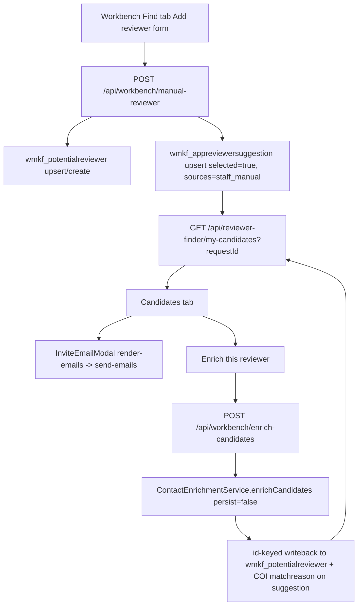

# Reviewer Workbench Manual Reviewer Add Design

> **Status:** Design spec, drafted 2026-06-07. Pre-implementation. Live-state
> claims are marked `[VERIFIED]`; design choices are marked `[PROPOSED]`.
>
> **Objective:** Let a program director manually add a sparse reviewer candidate
> (name required; email/affiliation optional) to a request's reviewer candidate
> pool, then optionally run that candidate through the same enrichment and COI
> pipeline used for applicant-recommended reviewers.

## Summary

`[PROPOSED]` Add a Workbench "Add reviewer" path that creates a selected
per-request candidate in Dataverse immediately, with distinct staff-manual
provenance, then supports explicit enrichment of that row. The workflow is
analogous to applicant-recommended reviewers, but not identical:

- Applicant-recommended reviewers start from legacy request lookup slots that
  already point at existing `wmkf_potentialreviewer` person rows.
- Manually added reviewers start from sparse staff-entered text and may need to
  create or upsert the `wmkf_potentialreviewer` person row first.

The durable candidate pool remains `wmkf_appreviewersuggestion`; the global
person remains `wmkf_potentialreviewers`. No new table is needed.

## Goals

- Add a sparse reviewer without running a full proposal search.
- Preserve origin truth: staff-added is not applicant-recommended and is not
  literature-discovered.
- Make the candidate visible in the Candidates tab immediately.
- Allow the existing no-email behavior: a candidate without email can be saved
  but cannot be invited until contact data is added or enriched.
- Reuse the applicant-recommended enrichment safety shape: `persist:false`
  enrichment, then id-keyed writeback to the known potential-reviewer row.
- Keep the feature per-request scoped; adding someone to one request must not
  imply they are recommended, excluded, or preferred globally.

## Non-Goals

- Do not auto-run enrichment on every manual add.
- Do not treat a name-only manual add as verified, PubMed-grounded, or
  applicant-suggested.
- Do not directly add read-only web suggestions to the saved pool without a
  staff action.
- Do not add a new Dataverse entity or Postgres table.
- Do not change reviewer invitation token, accept/decline, or upload behavior.

## Verified Current State

`[VERIFIED]` The Workbench Find tab search path already chains
`analyze -> discover -> enrich-contacts -> save-candidates`, and saved
candidates land in the same per-request pool as applicant recommendations
(`shared/components/reviewers/ReviewerSearchSection.js`).

`[VERIFIED]` Applicant-recommended reviewer ingestion is implemented by
`GET /api/workbench/applicant-reviewers`. It reads request reviewer lookup slots,
then idempotently materializes `disposition=recommended` rows in
`wmkf_appreviewersuggestion` using `ensureApplicantRecommended`
(`pages/api/workbench/applicant-reviewers.js`,
`lib/dataverse/adapters/reviewer-suggestion.js`).

`[VERIFIED]` Applicant-recommended enrichment is implemented by
`POST /api/workbench/enrich-recommended`. It reads existing recommended
suggestion rows, verifies/COI-checks them, runs contact enrichment with
`persist:false`, then writes bibliometrics/contact identity back by known
`potentialReviewerId` (`pages/api/workbench/enrich-recommended.js`).

`[VERIFIED]` The Candidates tab reads selected suggestion rows via
`GET /api/reviewer-finder/my-candidates?requestId=...` and renders them with
invite state, contact data, metrics, and the applicant-recommended badge
(`shared/components/reviewers/CandidatesPanel.js`,
`pages/api/reviewer-finder/my-candidates.js`).

`[VERIFIED]` `wmkf_appreviewersuggestion.wmkf_applicantdisposition` is a
request-junction field where `recommended` means applicant-suggested and `null`
means normal staff/Claude-discovered candidate
(`docs/atlas/dataverse-wmkf-appreviewersuggestion.md`). Manual adds should keep
this field `null`.

`[VERIFIED]` `potential-reviewer.upsertByEmail` can fill an existing person by
email or create a new person when no email match exists
(`lib/dataverse/adapters/potential-reviewer.js`).

## Data Model

### `wmkf_potentialreviewer`

`[PROPOSED]` Manual add creates or reuses the person row:

- If email is present, use `potentialReviewerAdapter.upsertByEmail`.
- If email is absent, create a new `wmkf_potentialreviewer` row with name and
  optional affiliation. This may create duplicate name-only rows; that is
  preferable to incorrectly merging two same-named humans.
- Fill-only semantics should preserve staff edits on existing email matches.

Fields from the form:

- `name` -> `wmkf_name` plus split first/last fields through the adapter.
- `email` -> `wmkf_emailaddress` when present.
- `affiliation` -> `wmkf_primaryaffiliation` and compatibility shadow
  `wmkf_organizationname`.
- `note` / reason -> `wmkf_whyreviewerwaschosen` when useful, and the request
  junction `wmkf_matchreason`.

### `wmkf_appreviewersuggestion`

`[PROPOSED]` Manual add creates or updates the request/person junction through
`reviewerSuggestionAdapter.upsert`:

- `wmkf_selected = true`
- `wmkf_applicantdisposition = null`
- `wmkf_sources` includes `staff_manual`
- `wmkf_matchreason` is the staff-entered note or a default like
  `Manually added by staff.`
- `wmkf_suggestionlabel` follows the existing request-title/person convention.
- `wmkf_relevancescore` may be `null` initially; no fake ranking score should be
  invented.

If an existing row for the same `(potentialReviewer, request)` exists:

- Preserve excluded-row fail-closed behavior from the adapter.
- Union `staff_manual` into `wmkf_sources` rather than clobbering prior sources.
- Set `selected=true` only when the row is not excluded and the staff action is
  explicitly "add to this request." Unlike lazy applicant ingestion, this is a
  direct staff action, so re-activating a previously soft-deleted non-excluded
  row is acceptable if confirmed by the UI.

### Provenance

`[PROPOSED]` Add a distinct provenance concept for staff manual candidates.
There are two implementation options:

1. Preferred: extend `lib/utils/reviewer-provenance.js` with
   `PROVENANCE_KINDS.STAFF_MANUAL = 'staff_manual'`, normalize
   `staff_manual` as a valid source, and render it as "Manually added."
2. Minimum viable: persist `wmkf_sources=staff_manual` and render a manual badge
   from the sources array in `my-candidates` / `CandidatesPanel`, deferring the
   full provenance DTO extension.

The preferred option is cleaner because it avoids overloading
`applicant_suggested` and keeps "manual seed" separate from
`barred_parametric`.

## API Design

### `POST /api/workbench/manual-reviewer`

`[PROPOSED]` New route. Body:

```json
{
  "requestId": "akoya_request GUID",
  "name": "Ada Lovelace",
  "email": "ada@example.edu",
  "affiliation": "Example University",
  "note": "Suggested by PD from prior panel work."
}
```

Response:

```json
{
  "success": true,
  "candidate": {
    "suggestionId": "...",
    "potentialReviewerId": "...",
    "name": "Ada Lovelace",
    "email": "ada@example.edu",
    "affiliation": "Example University",
    "sources": ["staff_manual"],
    "manualAdded": true,
    "invitable": true
  }
}
```

Route contract:

- `requireAppAccess(req, res, 'reviewers')`.
- Rate-limit like other Workbench mutation routes.
- Validate `requestId` as GUID before any OData use.
- Require `name` after trimming; cap length.
- Validate email format when present; reject malformed email rather than saving
  unusable contact data.
- Run inside `bypassDynamicsRestrictions('workbench-manual-reviewer')`.
- Read request context for title/cycle/program area if needed for labels.
- Upsert/create person.
- Upsert request suggestion.
- Return a hydrated candidate DTO compatible with Candidates tab, or trigger a
  client refresh of `my-candidates`.

Security boundary:

- Staff-shared reviewer workflow, matching the existing Workbench reviewer
  routes.
- No browser-supplied API keys.
- No third-party enrichment call in this route.

### `POST /api/workbench/enrich-candidates`

`[PROPOSED]` Generalize applicant-recommended enrichment rather than creating a
manual-only duplicate. Body:

```json
{
  "requestId": "akoya_request GUID",
  "blobUrl": "https://...",
  "analysisResult": {},
  "suggestionIds": ["..."],
  "scope": "manual"
}
```

Contract:

- Reads selected, non-excluded `wmkf_appreviewersuggestion` rows for the request.
- If `suggestionIds` is present, enrich only those rows.
- If `scope='recommended'`, it can replace or wrap the current
  `/api/workbench/enrich-recommended` behavior.
- If `scope='manual'`, enrich rows whose `wmkf_sources` includes
  `staff_manual`.
- Uses the same proposal-info resolution, PubMed verification, COI checks,
  `persist:false` contact enrichment, identity gates, id-keyed writeback, and
  deterministic COI `wmkf_matchreason` updates as `enrich-recommended`.

Migration path:

- Short term: add manual support to `enrich-recommended` under a broader helper
  and keep the old route as a compatibility wrapper.
- End state: UI calls the generalized route, and `enrich-recommended` becomes a
  thin alias or is retired after call sites move.

## UI Design

### Find Tab

`[PROPOSED]` Add a compact "Add reviewer" form near the applicant-recommended
card and search controls:

- Name input, required.
- Email input, optional.
- Affiliation input, optional.
- Note/reason textarea, optional.
- Primary action: "Add reviewer".

After success:

- Show the candidate in the durable Candidates tab on refresh.
- Also show a small confirmation in the Find tab with a link/action to switch
  to Candidates.
- If no email was provided, surface the same "no email - can't invite" state
  used by Candidates today.
- Offer "Enrich this reviewer" for manual rows, using the generalized
  enrichment route.

### Candidates Tab

`[PROPOSED]` Render a "Manually added" badge when:

- `manualAdded === true`, or
- `sources` includes `staff_manual`, or
- `provenance.kind === 'staff_manual'` once the provenance extension exists.

Manual rows should otherwise behave exactly like other saved candidates:

- editable via existing candidate edit modal,
- removable via existing soft-delete path,
- invitable when email exists,
- eligible for enrichment when contact/metrics are missing.

### Web Suggestions

`[PROPOSED]` The read-only web suggestions panel's "Add as candidate" action
should eventually call the same manual add route, not append fake
`claude_suggestion` provenance. The web lead can populate:

- `name`
- `note` with provenance URL/snippet summary
- `sources` including `staff_manual` and possibly `web_suggestion` if the
  provenance model is extended later

This keeps web-sourced leads human-vouched before persistence.

## Enrichment and Identity Safety

Manual adds are high-risk for wrong-person enrichment because name-only input
can match a same-named stranger. Therefore:

- Do not persist identity-bearing enrichment from `/api/reviewer-finder/enrich-contacts`
  directly for manual rows.
- Use the applicant-recommended pattern: `ContactEnrichmentService.enrichCandidates`
  with `persist:false`, then id-keyed writeback after identity gates.
- Treat missing affiliation as an unconfirmed-match risk unless the identity
  resolver reaches `probable` or `confirmed`.
- Do not persist ORCID, Scholar ID/URL, metrics, email, or affiliation from an
  unconfirmed same-name match.
- Run the final email through `ContactParser.isNameConsistentEmail` before
  persisting, matching the hardened applicant-recommended path.
- Preserve current COI behavior: institution COI should be recomputed after
  enrichment can promote a current affiliation, and coauthor COI should use the
  full proposal author set.

## Caller -> Persistence -> Consumer Trace



## Implementation Plan

### Phase 1 - Durable Manual Add

- Add `pages/api/workbench/manual-reviewer.js`.
- Add adapter helper if needed: `ensureStaffManualCandidate` in
  `lib/dataverse/adapters/reviewer-suggestion.js`, or use `upsert` with a small
  source-union wrapper.
- Add Find-tab UI form and refresh Candidates after success.
- Add manual badge in `CandidatesPanel`.
- Update `my-candidates` DTO to expose `manualAdded`.
- Update `docs/API_ROUTE_SECURITY_MATRIX.md` and Atlas docs for the new route.

### Phase 2 - Manual Enrichment

- Extract shared enrichment core from `pages/api/workbench/enrich-recommended.js`.
- Add generalized `pages/api/workbench/enrich-candidates.js`, or extend the
  existing route behind a compatibility wrapper.
- Add "Enrich" action for manual rows.
- Ensure sparse/no-affiliation wrong-person guards apply to manual rows.

### Phase 3 - Web Suggestion Integration

- Route "Add as candidate" from web suggestions through the manual add endpoint.
- Preserve web provenance in note/source without treating the lead as
  literature-verified.
- Decide whether to extend the provenance DTO with `web_suggestion` as a source
  separate from `staff_manual`.

## Tests

Unit/API tests:

- `manual-reviewer` rejects missing/invalid requestId.
- `manual-reviewer` rejects missing name.
- `manual-reviewer` rejects malformed email.
- Email match reuses existing `wmkf_potentialreviewer` and fill-only preserves
  non-empty fields.
- Name-only add creates a person and selected suggestion without enrichment.
- Existing non-excluded suggestion unions `staff_manual`.
- Existing excluded suggestion is not resurrected.
- Candidates DTO returns `manualAdded`.
- CandidatesPanel renders "Manually added" and "no email - can't invite".

Enrichment tests:

- Manual no-affiliation row with no `probable` identity does not persist
  same-name stranger email/ORCID/Scholar/metrics.
- Manual row with confirmed identity persists allowed enrichment fields.
- COI match reason is updated on the suggestion row.
- Partial enrichment failure does not remove the candidate from the pool.

Regression tests:

- Applicant-recommended enrichment remains unchanged.
- Normal search/save still persists literature candidates.
- Candidate removal still soft-deletes the suggestion and does not delete the
  global person.

## Gates and Documentation

Relevant gates after implementation:

- `npm run check:api-routes`
- `npm run check:atlas`
- `npm run check:atlas:self-test` if Atlas detection surfaces change
- `npm run check:fact-consistency` after doc updates
- Targeted unit tests for the new route and components
- Relevant reviewer/workbench tests already covering `my-candidates`,
  applicant recommendations, and invitation behavior

Documentation updates:

- `docs/API_ROUTE_SECURITY_MATRIX.md`: add `/api/workbench/manual-reviewer` and
  `/api/workbench/enrich-candidates` if added.
- `docs/atlas/dataverse-wmkf-appreviewersuggestion.md`: document
  `staff_manual` source convention and manual-add writer.
- `docs/REVIEWER_PROVENANCE_MODEL.md`: document `staff_manual` if the
  provenance DTO is extended.
- `docs/REQUEST_WORKBENCH_BUILD_PLAN.md`: add a short shipped/deferred note
  after implementation, not before.

## Open Questions

1. Should manual add re-activate a previously removed non-excluded candidate on
   the same request? This spec says yes when the staff action is explicit, but
   the UI should make that visible.
2. Should staff manual provenance be a first-class provenance kind now, or only
   a `wmkf_sources` convention until the broader provenance migration settles?
3. Should a web suggestion preserve its provenance URL in `wmkf_matchreason`, a
   structured note field, or only the transient web panel? The minimum viable
   path is `wmkf_matchreason`.
4. Should enrichment be per-row ("Enrich this reviewer") only, or should the
   Find tab also expose "Enrich all manual reviewers" for a request?
