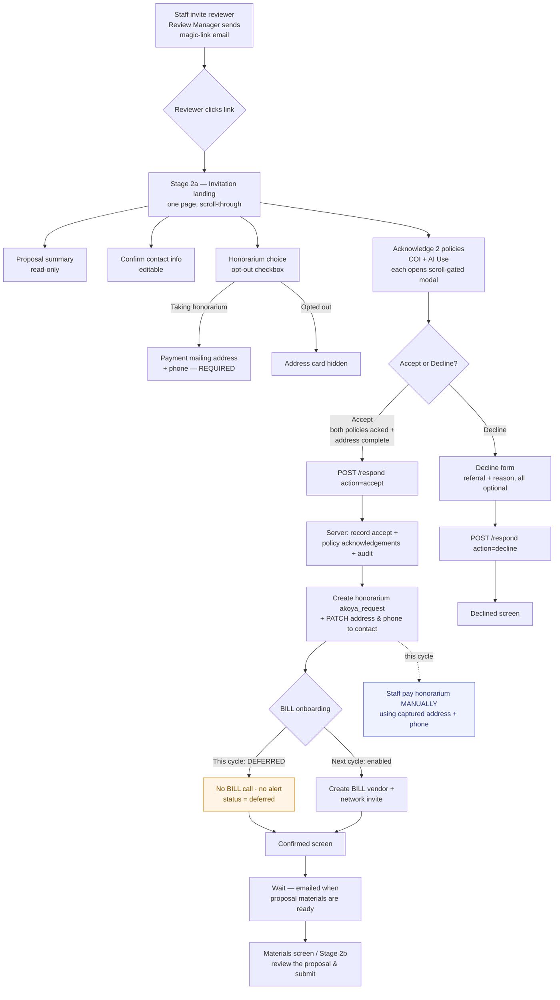

# Reviewer Onboarding — Process Flow & Screen Mockups

> What a potential reviewer sees at each stage of the invitation → accept/decline → confirmation
> journey, as built in the reviewer portal (`pages/external/review/[token].js` + the
> `shared/components/external/*` views).
>
> **Current cycle (2026-06):** automated bill.com onboarding is **deferred** (leadership decision).
> The portal still collects the mailing address **and phone** and creates the honorarium record;
> payment is processed **manually** by staff this cycle. The reviewer-facing experience below is
> unchanged by that decision — the BILL difference is entirely back-office.

---

## 1. Process flowchart



**Legend:** orange = this-cycle BILL-deferred path · blue = back-office manual step this cycle.

---

## 2. Screen-by-screen mockups

### Screen 0 — Invitation email (Review Manager)

```
┌────────────────────────────────────────────────────────────┐
│  Wood-McKee Knowledge Foundation                            │
│                                                            │
│  Dear Dr. ____,                                            │
│                                                            │
│  We'd like to invite you to review a grant proposal:       │
│  "<Proposal title>" (Request #<num>).                      │
│                                                            │
│            [  Review this invitation  ]  ← magic link      │
│                                                            │
│  This link is unique to you — please don't forward it.     │
└────────────────────────────────────────────────────────────┘
```

---

### Screen 1 — Stage 2a: Invitation landing (single scrollable page)

The reviewer sees one page stacked top-to-bottom. Accept is disabled until **both** policies
are acknowledged and (if taking the honorarium) the address + phone are complete.

```
╔════════════════════════════════════════════════════════════╗
║  PROPOSAL                                                    ║
║  <Proposal title>                                            ║
║  Request #<num> · <Applicant Institution>                    ║
║  PI  <Project leader>      Co-PIs  <names>                   ║
║  ── Abstract ───────────────────────────────────────────    ║
║  <abstract text…>                                            ║
╚════════════════════════════════════════════════════════════╝

╔════════════════════════════════════════════════════════════╗
║  Confirm your contact info                                   ║
║  We pre-filled what we have on file. Correct anything stale. ║
║  First name [Jane      ]      Last name [Doe        ]        ║
║  Display pref[Dr. Doe   ]      Title     [Professor  ]       ║
║  Affiliation [Example University                    ]        ║
║  Email      [jane@uni.edu]     ORCID    [0000-0000-…]        ║
╚════════════════════════════════════════════════════════════╝

╔════════════════════════════════════════════════════════════╗
║  [ ] I'd prefer to decline the honorarium.                   ║
║      The Foundation offers a modest honorarium for           ║
║      completed reviews; check this box to opt out.           ║
╚════════════════════════════════════════════════════════════╝

╔════════════════════════════════════════════════════════════╗   ← hidden if opted out
║  Honorarium payment address                                  ║
║  Where should we mail correspondence for your honorarium?    ║
║  Street address * [123 Main St                       ]       ║
║  Apt, suite (opt) [                                  ]       ║
║  City *      [Townsville]   State/Prov (opt) [CA      ]      ║
║  Postal code*[94000     ]   Country *   [United States ▾]   ║
║  Phone number * [+1 555 123 4567        ]   ← NEW, required  ║
╚════════════════════════════════════════════════════════════╝

  REQUIRED ACKNOWLEDGMENTS
╔════════════════════════════════════════════════════════════╗
║  Conflict of Interest policy        [ Read policy → ]        ║
║  Read and acknowledge to proceed.                            ║
╚════════════════════════════════════════════════════════════╝
╔════════════════════════════════════════════════════════════╗
║  AI Use policy                      [ Read policy → ]        ║
║  Read and acknowledge to proceed.                            ║
╚════════════════════════════════════════════════════════════╝

        [ Decline ]                    [ Accept and continue ]
                                        ▲ disabled until both
                                          policies acknowledged
```

*Required fields marked `*`. Country is a closed dropdown (ISO-2). Phone is required this cycle so
staff have a contact number for manual payment.*

---

### Screen 1a — Policy acknowledgment modal (opens from "Read policy →")

```
┌──────────────────────────────────────────────────────────┐
│  Conflict of Interest policy            v1          [ × ] │
│  ──────────────────────────────────────────────────────  │
│  <full policy text — reviewer must scroll to the bottom>  │
│  ░░░░░░░░░░░░░░░░░░░░░░░░░░░░░░░░░░░░░░░░░░░░░░░░░░░░░░░░░  │
│  ▼ scroll to enable                                       │
│                                                          │
│              [ I acknowledge this policy ]                │
│                ▲ disabled until scrolled to end           │
└──────────────────────────────────────────────────────────┘
```

After acknowledging, the card flips to: `✓ Acknowledged · v1 · View again`.

---

### Screen 2 — Decline form (if the reviewer clicks Decline)

All fields optional; "Submit without explanation" sends an empty payload.

```
╔════════════════════════════════════════════════════════════╗
║  Sorry to hear you can't take this on                        ║
║  Anything you can share helps us find a good replacement.    ║
║  None of these fields are required.                          ║
║                                                              ║
║  Anyone you'd suggest instead?                               ║
║  [ e.g., Dr. Sarah Chen at Stanford works on similar      ] ║
║  [ problems and would be a great fit.                     ] ║
║                                                              ║
║  Reason for declining   [ Select a reason (optional)    ▾]  ║
║    · Too busy · Conflict of interest · Outside my           ║
║      expertise · Bad timing · Other                         ║
║                                                              ║
║  Anything else? (optional)  [                            ]   ║
║                                                              ║
║  ← Back to invitation              [ Submit decline ]       ║
║                                     Submit without explanation║
╚════════════════════════════════════════════════════════════╝
```

---

### Screen 3 — Confirmed (terminal, after Accept)

```
╔════════════════════════════════════════════════════════════╗
║  CONFIRMED                                                   ║
║  Thank you. You're confirmed as a reviewer.                  ║
║                                                              ║
║  We'll email you when the proposal materials are available.  ║
║  Until then, you can return to this page any time using the  ║
║  original link.                                              ║
║                                                              ║
║  If something changes — calendar conflict, a conflict of     ║
║  interest you spotted — please reach out to your Program     ║
║  Director rather than waiting until materials are released.  ║
║                                                              ║
║  Changed your mind?  Switch to declining this invitation     ║
╚════════════════════════════════════════════════════════════╝
```

### Screen 3-alt — Declined (terminal, after Decline)

A short confirmation that the decline was recorded, with the option to switch back to accepting
(while the invitation is still open).

---

### Screen 4 — Materials available (later stage, `stage2b`)

When staff release the proposal materials, the reviewer is emailed again; the link in that NEW
email opens the **Materials** view (the send path re-mints the token, so it differs from the
invitation link — see `REVIEWER_INTERACTION_DESIGN.md` Stage 4; reviewers use the most recent
email). (Out of scope for onboarding, shown here for continuity.)

---

## 3. What happens behind the scenes on Accept

| Step | This cycle (BILL deferred) | Next cycle (BILL enabled) |
|---|---|---|
| Record accept + policy acks + audit | ✅ | ✅ |
| Create honorarium `akoya_request` (amount = Dataverse `honorarium.default_amount` setting) | ✅ | ✅ |
| Save mailing address **+ phone** to contact | ✅ (`address1_*`, `address1_telephone1`) | ✅ |
| bill.com vendor create + network invite | ⛔ skipped (`status: deferred`, no alert) | ✅ |
| Honorarium payment | **Manual** by staff, using captured address + phone | Automated via bill.com |

The accept itself never fails on a honorarium/BILL hiccup — those steps are non-fatal to the
reviewer's confirmation.

---

*Source components: `Stage2aView.js`, `PolicyAckModal.js`, `DeclineFormView.js`,
`AcceptedConfirmationView.js`, `DeclinedConfirmationView.js`, `MaterialsView.js`;
server flow `pages/api/external/review/[token]/respond.js` →
`lib/bill/honorarium-onboard-orchestrator.js` → `lib/bill/onboard-reviewer-service.js`.*
```
