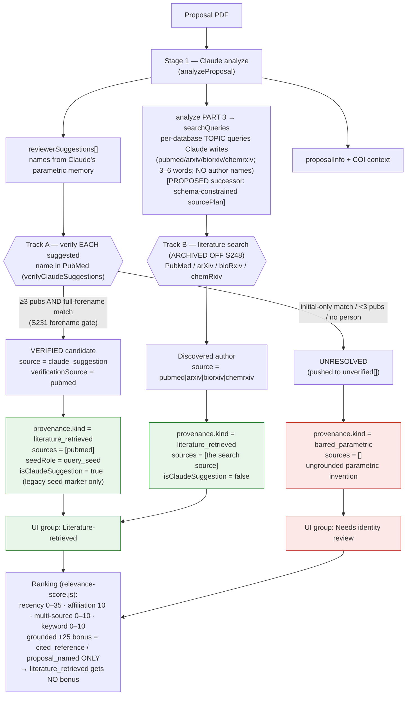

# Reviewer Finder — what "Claude-suggested" means in the provenance model

Status: explains the **Session 232 provenance-DTO migration** (sequencing step 1 of
`REVIEWER_FINDER_RETRIEVAL_REDESIGN_PLAN.md`). `[VERIFIED]` = read from current
source; `[PROPOSED]` = end-state not yet built. The pipeline still uses Claude as a
seed generator today; the redesign's later steps replace that with retrieval-first
origination.

## TL;DR

In the **old** model there was a binary axis: a candidate was either a *Claude
suggestion* or a *database discovery*, and being Claude-suggested earned a +25
ranking bonus and its own UI section.

In the **new** model that axis is gone. The provenance axis is **groundedness, not
"did Claude touch it."** Claude is demoted from a *candidate source* to a **query
seed generator**. A name Claude proposes is only a *hypothesis*; it becomes a real,
selectable candidate **only if the literature grounds it**:

- **Claude name that verifies in PubMed** → `provenance.kind = literature_retrieved`
  — **identical** to a database-discovered author. The only residue that Claude
  originated it is the legacy `isClaudeSuggestion: true` flag and
  `seedRole: query_seed`. It gets **no ranking bonus** and sits in the same UI group
  as DB discoveries.
- **Claude name that cannot be grounded** → `provenance.kind = barred_parametric`
  — an ungrounded parametric invention, grouped under **"Needs identity review"**
  and (`[PROPOSED]` end-state) slated to be dropped silently.

So **"Claude-suggested" is no longer a provenance category.** There is no
`claude_suggestion` kind, no Claude-vs-database split, and no +25 for being
Claude-suggested. Claude proposes *query seeds*; the databases decide who is a real
candidate.

## Workflow

## Why a verified-Claude candidate is `literature_retrieved`, not its own kind

`[VERIFIED]` In `discovery-service.js`, a Claude suggestion that passes PubMed
verification is built with `withReviewerProvenance({...suggestion,
source:'claude_suggestion', verificationSource:'pubmed'}, {kind:
LITERATURE_RETRIEVED, sources:['pubmed'], seedRole: QUERY_SEED})`. The candidate was
*grounded against real PubMed publications* — that grounding is what makes it a
candidate, so its provenance is `literature_retrieved`, the same as any author
pulled from a literature search. "Claude proposed the name" is recorded only as the
`seedRole` and the legacy `isClaudeSuggestion` boolean — neither is a provenance
kind, and neither earns a ranking advantage.

## The full provenance kind vocabulary

| `provenance.kind` | Grounded by | Today's pipeline | Disposition |
|---|---|---|---|
| `cited_reference` | DOI/PMID → exact authorship | `[PROPOSED]` (Step 4) | Top precision; +25 bonus |
| `proposal_named` | proposal text (expert-authored) | `[PROPOSED]` (Step 4) | High-value + COI flag; +25 bonus |
| `applicant_suggested` | the applicant | existing flow | Own UI group |
| `literature_retrieved` | the databases | **the spine today** (Track A verified; Track B archived off S248 — `DiscoveryService.TRACK_B_ENABLED=false`, dormant) | Hypotheses until resolved; no bonus |
| `grounded_seed` | a query seed that grounded | `[PROPOSED]` | Ground-or-drop |
| `barred_parametric` | training data only | **Track A unverified today** | Needs identity review → `[PROPOSED]` drop |

## What still carries the legacy `isClaudeSuggestion` flag (and why)

`[VERIFIED]` `isClaudeSuggestion` is still set (`true` for Track A, `false` for
Track B) and still rides on the candidate during migration, but it is **no longer
authoritative**: provenance, the UI grouping, and the ranking bonus all read
`provenance`, never `isClaudeSuggestion`. The flag remains only so legacy
roster/save/UI reads don't break mid-migration. Provenance is **never** inferred
from it (`reviewer-provenance.js`).

## Net effect on ranking

Two things change for a verified-Claude (Track-A) candidate: it is now
`literature_retrieved` so it loses the +25 grounded bonus, **and**
`claude_suggestion` no longer counts as a corroborating "source" so its
multi-source bonus falls 10→5.

**Analytically guaranteed by the current code** (recency/affiliation/keyword terms
are untouched, so they cancel in the delta):
- Every Track-A candidate drops **exactly 30 points** (−25 bonus, −5 multi-source);
  every Track-B candidate is **unchanged (0)**. This holds because Track A only ever
  grounds via PubMed (`verificationSource:'pubmed'`, `source:'claude_suggestion'`),
  so the old multi-source count is always 2 and the new is always 1.
- A uniform −30 shift applied to one subset **cannot reorder candidates within that
  subset**, so verified-Claude candidates keep their relative order, and **the only
  possible reordering is at a Track-A / Track-B boundary** (an A dropping below a B).

> **Note (S248):** Track B is now **archived off** (`DiscoveryService.TRACK_B_ENABLED=false`),
> so the discovered set is empty and there are **no Track-B candidates** in practice — the
> Track-A/Track-B boundary reordering above is **moot** until Track B is re-enabled. The
> per-candidate delta analysis remains valid for the code as written.

**Observed in the Session 232 sample (2 research requests; small, not a population
rate — analyze is stochastic, so candidate sets vary slightly run-to-run):** the
displayed tables were 11 Track-A / 1 Track-B (1002959) and 9 Track-A / 0 Track-B
(1003020). Every Track-A delta printed was −30 and every Track-B delta 0, with no
counter-instance. Both lists were Track-A-dominated, so boundary crossovers were few
(1–2 across runs) — a literature-discovered candidate rising past the weakest
verified-Claude one. How often that fires in general depends on how many Track-B
candidates a request surfaces, which this two-request sample is too small to
quantify.

Absolute `wmkf_relevancescore` compresses ~30 pts for verified candidates, but
nothing gates on an absolute reviewer score (`[VERIFIED]` — ordering/display only).
